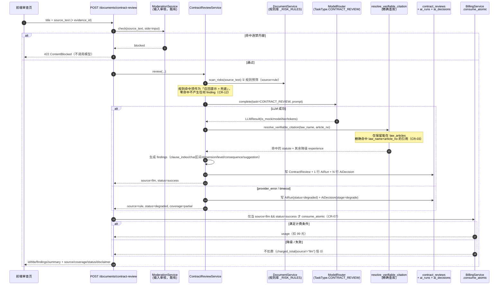
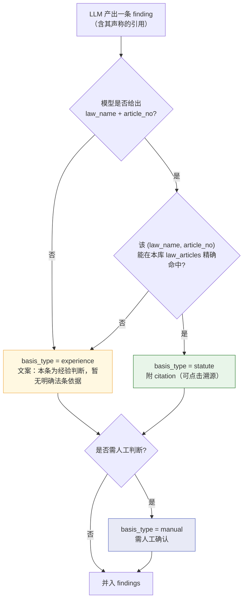
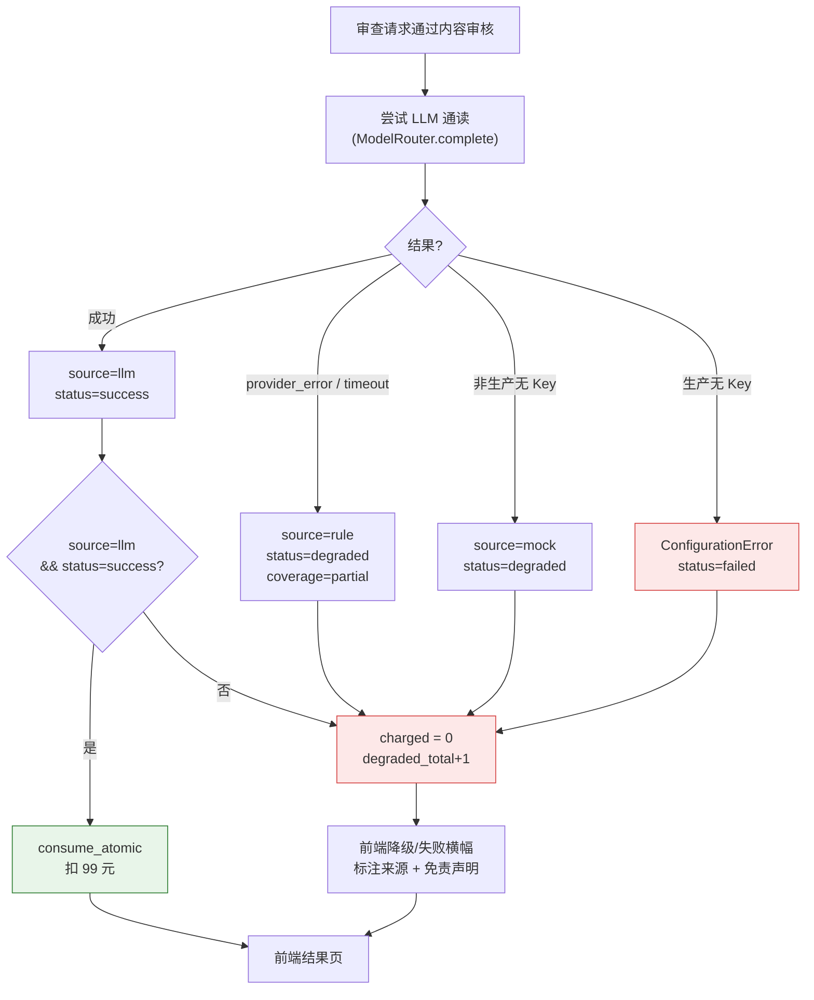

# 合同审查真实化 PRD（P0-16）

**日期**：2026-09-16
**类型**：PRD
**参与成员**：析客（需求分析师）/ 竞析（竞品分析师）/ 瑞思（用户研究员）/ 方向明（主理人，编排 + 代码级核实 + §5 分析）/ 数析（数据分析师，**本轮未提交独立结论，见 §5 与成员产出索引**）
**事实基准**：主理人（产品总监）2026-09-16 代码级核实结果（凡与文档冲突处，以代码为准）
**承前**：`remaining-work-inventory-2026-09-16.md`（P0-16 定位为「产品口径问题，先对齐再动工」）、`prd-v3-gap-closure-spec-2026-09-12.md`（功能规格书 v3.0）、`reference/律小智AI法律助手PRD_v2.0.md`（§5.9 合同审查模式原始承诺）

---

## 📌 TL;DR（执行摘要）

- **一句话**：合同审查是 PRD 承诺的**核心差异化能力**、**按 99 元/次计费**（加急 169 元），但它**零 LLM 调用**——一个 88 行的关键词匹配器，产出上限 **12 条固定文案**，法条依据是**假的**（与具体风险无因果关系），且**一份不含那 7 个关键词的合同会被判「整体风险等级：NONE」**。
- **为什么现在做**：这是本项目**最后一个「宣称能力与实现之间的空洞」**，也是剩余 3 个 P0 中**唯一未被外部依赖阻塞**的（#9 卡企微资质、#12 无支付 SDK）。原始待办明确写着「**需产品先对齐再动工**」——本 PRD 是必经环节。
- **本轮范围**：把「99 元/次」重新定义为**一个可交付物**（条款定位 + 风险维度 + **可验证依据** + redline + 导出 + 来源标注），并设**计费诚实性硬门槛**（**仅 `source=llm && status=success` 才计费**）。
- **核心取舍**：法条库**仅 12 条**（`seed/laws.py`）——「每条风险附法条」在本库**根本做不到**。**不绕过约束去补法条**，而把它变成**防幻觉机制**：模型引用只要无法在本库 `law_articles` 精确命中，就**降级为「经验判断」**。**诚实不是妥协，是本库约束下的最优解。**
- **头号阻断项**：**「零发现即放行」**（`_overall([]) → NONE`）把**系统性假阴性包装成「审查通过」的虚假保证**——必须修（区分「已完整分析无风险」与「未命中规则库」），列为**阻断级缺陷**。
- **刺耳但必须保留的结论**：竞析判定**「当前实现连行业最低门槛都不满足，不可按 99 元/次收费」**；瑞思判定**「零发现即放行是阻断级缺陷」**。

---

## 🎯 核心结论卡片

| 项目 | 内容 |
|------|------|
| **推荐方案** | 新增 `TaskType.CONTRACT_REVIEW` 走 `ModelRouter.complete`（LLM 逐条通读）+ 规则引擎**降级为预筛/召回兜底**（`source=rule`）+ **依据分层强校验**（新增 `resolve_verifiable_citation`，按 `(law_name, article_no)` 精确查库，库内不命中即降级为「经验判断」；**禁止复用 `validate_citations`**，语义相反）+ `ContractReview` 增补留痕字段 + 写 **1 行 `AiRun` + N 行 `AiDecision`** + **计费门控**（仅 llm+success 计费）+ 新增**前端审查结果页**（含定位高亮 / 一键采纳 / 导出 Word / 失败态 / 免责声明） |
| **优先级** | **P0**（上线前置；门槛二「商业合规」；PRD §5.9 差异化承诺） |
| **预期影响** | 合同审查从「**12 条固定文案 + 假引用 + 零发现放行**」→「**逐条定位 + 可验证依据 + redline 交付物 + 计费诚实**」；消除「99 元收在规则引擎产出上」的合规风险 |
| **资源需求** | **≈ 41 人日**（§6 **P0 逐条表汇总**：**3×L(5) + 10×M(2.5) + 1×S(1)**；**CR-18 升 P0 后由 ≈38 增至 41**；含前端 CR-13 的 L）；**零新增依赖**（`ModelRouter` 已具备，仅需新增一个 `TaskType`）；**数据任务**：法条库扩充另计（见 Q4）。⚠️ **本框为逐条表汇总；若与 §6 逐条表不一致，一律以逐条表为准** |
| **风险等级** | **高**——① 法条库仅 12 条，绝大多数风险拿不出库内依据（**已转为「诚实标注」设计，不再是缺陷**）；② 合同可能属「敏感数据不出域」场景（`sensitive=True` → LOCAL 档，未配 LOCAL Provider 时生产直接抛错）；③ 「零发现即放行」若不修，等于把假阴性当通过 |

---

## 1. 产品目标（3 个清晰、正交的目标）

| # | 目标 | 正交性说明 | 成功判据（见 §5） |
|---|------|-----------|------------------|
| **G1** | **让产出「可交付」** | 解决**交付物形态**问题（99 元到底买到什么），与「内容是否可信」正交 | 每条风险**可点击定位到原文精确区间**；输出含**可采纳 redline 文本**并可**导出 Word**；`reviewed_ratio` 可见 |
| **G2** | **让结论「可信且诚实」** | 解决**内容可信度**问题（依据真伪、有无放行），与「交付物形态」正交 | `basis_type=statute` 的 finding **100%** 有库内可命中 citation；**零发现不得输出 `overall_risk=NONE`**；返回体**必含 `source`** 字段 |
| **G3** | **让计费「与产出质量绑定」** | 解决**商业诚实性**问题，与前两者正交（是底线，不是加分项） | **降级/失败产出计费恒为 0**；可据 `AiRun` 还原模型/token/成本/降级原因；计费指标 `charged_total{source!="llm"}` **恒为 0** |

> **三者关系**：G1 是「**给什么**」，G2 是「**是否可信**」，G3 是「**是否敢收这 99 元**」。当前实现三者**全部不达标**——G1 是 12 条固定文案、G2 是假引用 + 零发现放行、G3 是「只要返回 200 就扣 99 元」。**G3 不达标，则 99 元定价本身构成合规风险。**

---

## 2. 用户故事（5 个场景，含优先级）

**US-1｜律师审一份 30 页的采购合同（G1，P0）**
作为**办案律师**，我把合同传上去，希望 AI 给出的**每条风险都能点击跳到原文对应条款并高亮**——而不是给我一段 ±20 字符的截断片段让我自己去翻 30 页找。**「定位到行/段」是可验证性的物理前提**：清单说「违约金未明确」却让我自己找，找不到 = 不信任。

**US-2｜律师把 AI 初稿改成可发稿（G1，P0）**
作为**律师**，我拿到审查结果后，希望直接得到**可采纳的 redline 文本**（改好的句子/条款），并能**一键导出 Word** 发给对方——**撰写修改意见才是纯体力活，最耗时、最低价值、最该被自动化**。（瑞思：AI 收益最大处在「出稿/redline」，不是「识别风险」。）

**US-3｜律师核验 AI 给的法条（G2，P0）**
作为**律师**，当我看到「依据《民法典》第 X 条」时，我会**去核验**。如果核验发现法条与风险**对不上**，我会立刻怀疑整个结果是编造的。**我宁愿它诚实说「这是经验判断，暂无明确法条依据」**——律师本就不排斥经验，排斥的是**把经验伪装成法条**。

**US-4｜专业用户识别「假 AI」（G2，P0）**
作为**高频使用的律师**，我几乎**必然察觉**：文案雷同、条数与内容无关、法条不匹配、截断乱码。一旦认定是「假 AI」，**信任不可逆崩塌并可能扩散投诉**。因此结果页**必须标注来源**（`source ∈ {llm, rule, mock}`）与覆盖度——**既是诚信也是责任边界**：不标注，用户会默认全是 AI 分析并据此决策。

**US-5｜小微企业主看审查结论（G2，P1）**
作为**没有专职法务的小微企业主**，我付 2000–5000 元找律师审合同，现在希望 AI 用**白话**告诉我「这条为什么危险 / 怎么改 / 不改会怎样」——**核心诉求是「能不能签 + 怎么改 + 一份能发给对方的改稿」**。

> **（可选 P2）US-6｜按甲/乙方立场过滤风险**：作为**乙方**，我希望风险按「对我方不利程度」排序/过滤，而不是中立地罗列全部。

---

## 3. 用户研究洞察（来自瑞思，**保留其证据强度声明**）

> **瑞思的证据强度声明（原样保留）**：本仓库**无访谈、无埋点、无客服工单**，除标注为「事实」者外，以下均为**基于 PRD 与行业常识的推理**。

- **AI 收益最大处在第 ④ 步（出稿/redline），不是第 ② 步（识别风险）**：识别风险律师自己又快又信自己；**撰写修改意见才是纯体力活，最耗时、最低价值、最该被自动化**。
- **误报杀「用不用得起来」，漏检杀「敢不敢用」**。但对本实现真正的危险不是「偶尔漏」，而是**规则引擎只认 7 个关键词，凡不含者一律判「无风险」，还输出「整体风险等级：NONE」——这是把系统性假阴性包装成「审查通过」的虚假保证**。判断：专业场景**宁多报（可解释、可排除）不可漏报**，且**绝不能「零发现即放行」**；能力不足时应**降低结论强度**（「未命中规则库」≠「合同安全」）。
- **输出形态**：律师要 **redline / 可直接采纳的修订稿**，其次内联批注，纯清单价值最低（他自己就会列）——**交付物才是计费单位**。小微企业主要白话版清单 + 批注，但真正对标的是「律师交付物」（他们原本付 2000–5000），核心诉求是「**能不能签 + 怎么改 + 一份能发给对方的改稿**」。
- **「定位到行/段」是硬需求**，因为它是**可验证性的物理前提**：清单说「违约金未明确」却让用户自己翻 30 页，找不到 = 不信任。当前 ±20 字符截断把最耗时的「定位」还给了用户。
- **无依据的建议**：专业用户对「看似具体却无依据」的断言会**降级信任**（怀疑编造）；**诚实标注「经验判断，无法条依据」反而提高接受度**——律师本就不排斥经验，排斥的是**把经验伪装成法条**。而本实现更糟：给的是**假依据**，一核验就崩。**必须二选一：给真依据，或诚实说无。**
- **失败模式感知**：低频单次难察觉；高频/专业用户**几乎必然察觉**（文案雷同、条数与内容无关、法条不匹配、截断乱码），会认定是「假 AI」，信任不可逆崩塌并可能扩散投诉（PRD 已有投诉链路）。故**必须标注结果来源**——**既是诚信也是责任边界**。
- **用户故事（瑞思标注优先级，本 PRD 已采用）**：P0 带行号/条款编号定位的风险清单；P0 每条风险附真实可点击法条依据或明确标「经验判断」；P0 一键生成可导出 Word 的 redline；P1 风险**说明后果**（如「违约金可能被法院调减」）而非仅标「中风险」；P1 小微企业主白话解释「为什么危险/怎么改/不改会怎样」；P1 结果页标注来源与免责边界；（可选 P2）按甲/乙方立场过滤风险。
- **瑞思明确说「无法判断」的（原样保留）**：**小微企业主究竟为「报告」还是为「改好的合同」付费、律师审合同真实耗时占比、误报容忍阈值——需 5–8 场律师深访 + 2–3 家小微企业主访谈 + 竞品试用对比才能定，当前无一手数据，不宜拍脑袋。**

---

## 4. 竞品对比（来自竞析）

### 4.1 行业「99 元/次」的最低可接受水准（竞析判定）

1. **逐条切分并给出可点击定位到原文**的风险点（**非固定文案**）；
2. 至少覆盖 **3 类风险维度**且带 **高/中/低等级**；
3. 每条风险附**可溯源**的法条（检索不到就标注「暂无明确法条依据」或降置信度，**禁止硬凑**）；
4. 输出**可采纳的修订建议并支持导出 Word**；
5. 明确**免责声明**「AI 辅助意见，不构成法律意见」。

### 4.2 竞品全景

| 产品 | 定位 | 关键能力 |
|------|------|---------|
| **MeCheck（幂律）** | 国内合同审查 | **句/段级定位** + 5 大审查类型约 **300+ 审查点** + 法条判例**自动援引** + 多色高亮/修订批注 |
| **e签宝** | 国内电子签约 + 审查 | **条款级 + 原文定位**（点击风险项自动定位原文）+ 按《民法典》**19 种典型合同**预置规则 + **一键修订/导出** |
| **通义法睿** | 国内大模型法律 | **段落级带位置标注** + **RAG 检索法条判例** + **4 元/页** |
| **Harvey** | 国际头部 | **clause-level** + playbook + **redline**（约 $1000–2000/席/月） |
| **LegalOn** | 国际合同审查 | **clause 级** + **Low/Med/High** + **Word 一键 redline**（约 $550/席/月） |
| **Spellbook** | 国际 | **clause 级** + **Word 内 redline** |
| **Kira / Luminance / ML** | 国际 | **条款抽取**（clause extraction） |

### 4.3 差距清单（按对用户价值的边际影响排序）

1. **无「风险点→原文精确位置」映射**（直接违反 PRD 验收①）；
2. **产出上限 12 条固定文案、与命中位置无关**（用户当场识别为假）；
3. **法条依据与风险无因果**（法律产品最致命）；
4. 无**风险等级/维度体系**；
5. 无**修订建议 / redline / Word 导出**（行业标配）；
6. 无**立场切换**（甲/乙方）；
7. 无**合同类型识别**与分类型审查点；
8. 零前端零测试，无「审查失败」状态与免责声明。

### 4.4 竞析结论（原样保留）

> **当前实现连最低门槛都不满足，应判定为不可按 99 元/次收费。**

### 4.5 竞析未能核实的（**如实标注为「搜不到」**）

- **未搜到**任何产品会标注「本次结果由规则引擎产出，未使用模型」；
- **未搜到**公开的「失败/降级不计费」条款。

> **说明**：正因为「降级产出如实标注来源」与「降级不计费」在公开竞品中**搜不到先例**，本 PRD 的这两条设计**没有可直接照搬的行业范式**——属**本项目基于诚信与合规要求自定**，需产品/法务确认（见 Q2、Q5）。

---

## 5. 数据依据（主理人代码级核实 + 分析；数析结论待补）

> **证据强度声明（主理人）**：§5.1/5.2/5.3 为读代码 + 只读查询**实测**；§5.4 成本为**主理人量级推算**，单价为外部公开定价，**未在本项目实测**；§5.5 指标与告警为**主理人建议**，待产品/运维确认。**（注：数析本轮未提交独立分析结论。）**

### 5.1 计费事实（实测）

| 事实 | 证据 |
|------|------|
| 价格 | `billing_service.py:28-33` `_PRICE_CENTS[CONTRACT_REVIEW] = {"standard": 9900, "urgent": 16900}`（单位分） |
| **「超量」不是免费，是换一种方式继续收费** | `_ESCALATE_TYPES`（`:57`）含 CONTRACT_REVIEW；额度耗尽置 `escalate_to_lawyer=1`（`:363`），`_to_work_order`（`:342`）**仍按 9900/16900 生成计费工单** |
| 同一功能两个质量档，**用户无从分辨** | 额度内 = 零模型关键词匹配器；额度外 = 人工律师。**返回体无字段标注当前处于哪档** |
| **只要返回 200 就扣 99 元** | `documents.py:152→159`：先 `review()` 再 `consume_atomic()`，中间**无 try/except、无 is_mock/来源门控**。因 `review()` 是纯本地操作，**永不失败、永无降级分支** ⇒ 99 元 100% 收在规则引擎产出上 |
| 前瞻风险（推算） | 一旦接入模型，现有代码**没有任何降级门控** ⇒ Mock/超时/兜底产出都会照扣 99 元 |
| `UsageType` 全量 | `enums.py:221-225`：QA / DOCUMENT / CONTRACT_REVIEW / COMPLIANCE_SCAN |

### 5.2 留痕与可观测性缺口（实测）

- `ContractReview`（`document.py:80-96`）字段仅 id/evidence_id/created_by/title/source_text（截断 5000 字）/findings/overall_risk/summary。**缺失**：is_mock、model_name、model_tier、prompt_tokens、completion_tokens、duration_ms、cost_cents、run_id。
- 对比 `AiRun`（`ai_run.py:42-48`）上述字段**全部具备**；`case_copilot` 一次运行写 **1 行 AiRun + 4 行 AiDecision**。合同审查：**0 行 AiRun、0 行 AiDecision**。
- `metrics.py`（435 行）**无任何合同审查指标**；唯一间接信号 `quota_exhausted_total{usage_type}`（`:323`）不区分产出质量。
- 审计：`AuditAction.CONTRACT_REVIEW` 写入点 `documents.py:164-177`，detail={title, overall_risk, finding_count, evidence_id}，**无模型/来源字段**。
- **实测 `storage/nlawer.db`**：`contract_reviews` = **1 行**（'采购合同', HIGH）；`usage_records` CONTRACT_REVIEW = 1；**`audit_logs` 中 CONTRACT_REVIEW = 0 行**（仅 33 条 LOGIN）⇒ **这条已有审查完全无法还原审计**。
- 当前**无法回答**的业务问题：① 本月多少次审查实际是降级产出；② 单次耗时/token/成本；③ 产出由哪个真实模型/版本生成；④ 计费记录与产出来源的对应关系。

### 5.3 法条库规模与**域构成**（**决定设计方向**）

`backend/app/seed/laws.py` **共 12 条法条**（实测 `grep "article_no"` 12 处命中；正则解析 `seed/laws.py` = 12 条、库中 `law_articles` = 12 行，两法互证）。

> **勘误提示**：主理人 brief 记为「13 条」，**代码实测为 12 条**（brief 的 `grep -c "law_name"` 多算 1 行非条目文本）——本 PRD 以代码为准。

**域构成（实测）**：

| 法律 | 条数 | 条文 |
|------|------|------|
| 中华人民共和国劳动合同法 | 5 | 第26、38、40、47、82、87 条 |
| 中华人民共和国劳动争议调解仲裁法 | 2 | 第6、27 条 |
| **中华人民共和国民法典** | **3** | **第563（法定解除）、577（违约责任）、584（损失赔偿）** |
| 工伤保险条例 | 1 | 第37 条 |

**关键结论（不是「量少」，是「域不匹配」）**：

> **12 条中 8 条属劳动法域；民法典仅 3 条，且集中在「解除 / 违约责任 / 损失赔偿」；零条覆盖买卖合同、租赁、承揽、委托、保证、保密、知识产权、管辖与争议解决——而这些正是商事合同审查的主战场。** 佐证：库中唯一一条真实审查记录是 `contract_reviews` id=1 **'采购合同'**（`overall_risk=HIGH`），**恰恰是对本库而言最无依据可引的一类**。
>
> **因此「诚实标注」不是我们选择的设计，而是本库约束下的唯一可行路径**；扩充语料是**独立的数据任务**，不是本轮的代码任务。

- `LawArticle` 模型（`app/models/citation.py:46-61`）字段：law_name / article_no / chapter / content / tags / effective_date / region / timeliness，租户固定 `platform` 全平台共享。
- **含义**：竞析指出行业标准是「RAG 检索法条」，但**我们只有 12 条、且域不匹配的可检索语料**——「每条风险都附法条」在本库**根本做不到**，硬凑就正是现在这个假引用。**这是设计的关键约束，不是可以绕过的细节。**

### 5.4 成本估算（量级推算 · 非实测）

- 合同 5,000–30,000 汉字，中文 ≈1 token/字，输入含指令 ≈+800 token，输出 ≈1,000–3,000 token。
- 单价取低档（≈¥0.8/百万 in、¥2/百万 out）与高档（≈¥2/百万 in、¥8/百万 out）。
- **最坏 30,800 in / 3,000 out ⇒ 高档约 ¥0.086（8.6 分）**，低档约 ¥0.031。即便分块多轮（×10）仍 **< ¥1**。
- **结论：毛利 > 99.9%，成本不是障碍——真正障碍是计费诚实性与留痕。**（佐证：`ai_runs.cost_cents` 全为 NULL，从未真正计量。）

### 5.5 成功指标与告警（**主理人建议**，待产品/运维确认）

| 指标 | 类型 | 口径 | 目标 / 告警 |
|------|------|------|------------|
| `nlaw_contract_review_total{source,status}` | Counter | source=llm\|rule\|mock，status=success\|degraded\|failed | **北极星**：口径 = llm success 占比，**目标 ≥ 99%** |
| `nlaw_contract_review_degraded_total{reason}` | Counter | reason=provider_error\|timeout\|mock\|rule_fallback | **护栏①**（降级产出占比） |
| `nlaw_contract_review_charged_total{source}` | Counter | 按产出源 | **护栏②（计费诚实性）**：降级产出计费**恒为 0** |
| `nlaw_contract_review_duration_milliseconds{source}` | Histogram | P99 | 护栏③ |
| `nlaw_contract_review_tokens{kind}` | Histogram | kind=prompt\|completion | 护栏③ |
| `nlaw_contract_review_llm_provider_up` | Gauge | Provider 可用性 | 护栏③ |

**告警规则**：

- **降级占比告警（critical，for 5m）**：
  `(sum(rate(nlaw_contract_review_total{source=~"rule|mock"}[5m])) / clamp_min(sum(rate(nlaw_contract_review_total[5m])),1)) > 0.01`
- **计费诚实性告警（critical，任何降级结果被计费立即告警）**：
  `sum(rate(nlaw_contract_review_charged_total{source!="llm"}[5m])) > 0`

### 5.6 验证方案（采纳路径评估）

**① LLM 边界抽成可替换依赖（可离线验证的前提）**

- `ContractReviewService.__init__(self, db, router: ModelRouter | None = None)`——默认用真实 `router` 单例，**测试注入 `FakeRouter`**（返回固定 JSON），使 LLM 路径**不依赖真实 Key 即可端到端跑通**。
- 与项目既有范式一致（`case_copilot` 的依赖注入风格）。

**② 可离线验证的断言清单**（无需真实 Key，用 `FakeRouter`）：

| # | 断言 | 关联 |
|---|------|------|
| 1 | `original == source_text[char_start:char_end]`（逐字一致） | CR-01 |
| 2 | `basis_type=statute` 100% 有 `resolve_verifiable_citation` 命中；命中不到必降级 `experience` | CR-03 |
| 3 | 不含 7 个关键词的合同**不得**得 `overall_risk=NONE` | CR-10 |
| 4 | 降级/失败路径 `charged_total{source!="llm"}` **恒为 0**、用户余额不变 | CR-07/09 |
| 5 | 每条降级路径（含 sensitive 分支）有 `AiDecision(stage=degrade)` | CR-11/18 |
| 6 | `sensitive=True` 时 provider 选择 = LOCAL（可据 `AiRun.model_tier` 还原） | CR-18 |
| 7 | `source` 字段**必存在**于返回体 | CR-06 |
| 8 | 规则零命中不产 finding；规则命中项被并入或被显式引用 | CR-12 |

**③ 当前无法验证、须留到真实 Key 环境的 6 项**（**不得声称已验证**）：

1. 真实模型 **JSON 输出稳定性 / 幻觉率**（`FakeRouter` 是确定性文本，测不出随机性）；
2. 北极星 **`llm success ≥ 99%`**（需真实 Provider 可用性）；
3. **维度集合稳定性**（`FakeRouter` 固定输出，测不出模型随机漂移）；
4. **CR-17 分块 `reviewed_ratio = 100%`**（需真实长合同 + 真实模型）；
5. **`sensitive → LOCAL` 的生产行为**（需真实 LOCAL Provider 配置）；
6. **真实 token / cost**（`ai_runs.cost_cents` 需真实 Provider 回传）。

**④ 真实 Key 冒烟测试（`skip-unless-LLM_CHEAP_API_KEY`）**

- 新增一条 **skip 条件为「未配 `LLM_CHEAP_API_KEY`」** 的冒烟测试：真实调用一次 `router.complete(CONTRACT_REVIEW, ...)`，断言返回可解析、`is_mock=False`、token > 0。
- **理由**：否则「**真实模型路径从未端到端验证**」会带着上线（本项目历史上多次因「未验证即声称完成」出错）。**CI 未配 Key 时自动 skip，不阻塞**；上线前**必须**在配 Key 环境跑通一次。

---

## 6. 需求池（P0 / P1 / P2）

> 编号 **CR-xx**（Contract Review）。工作量单位：**人日**（S≈0.5–1、M≈2–3、L≈5+）。
> **每条验收标准均可测**（Given/When/Then 或明确断言）。术语沿用既有：`ctx.tenant_id`/`ctx.user_id` 来自 `get_tenant_context`。

### 6.1 交付物形态（G1）

| 编号 | 需求 | 优先级 | 验收标准（可测） | 估算 |
|------|------|--------|-----------------|------|
| **CR-01** | **条款级切分 + 可点击定位** | P0 | Given 一份含 N 段的合同文本；When 发起审查；Then 每条 finding 返回 `clause_index`（段落序号）、`char_start`/`char_end`（原文**精确字符区间**）、`clause_no`（条款编号，可空）、`original`（**该条款完整原文，非 ±20 字符截断**）；前端点击某风险项 → 原文视图**自动滚动并高亮** `[char_start, char_end]`；**断言**：`original == source_text[char_start:char_end]`（逐字一致）。满足 PRD 验收① | L |
| **CR-02** | **风险维度体系 + 高/中/低等级 + 后果说明** | P0 | 每条 finding 含 `dimension`（如 权利义务失衡 / 违约责任 / 争议解决 / 保密 / 解除终止 / 效力瑕疵），**至少覆盖 ≥3 类**；`risk_level ∈ {HIGH, MEDIUM, LOW}`；`consequence`（**后果说明，非空**，如「违约金可能被法院调减」）；Given 一份同时含「不可撤销」与「最终解释权」的合同；Then 输出 **≥2 条不同维度**的 finding 且各带等级与 consequence；**断言**：同一合同多次审查 `dimension` 集合稳定（无随机漂移）。满足验收② | M |
| **CR-04** | **可采纳的修订建议（redline 文本）** | P0 | 每条 finding 返回 `suggestion_text`（**可直接采纳的改写后文本**），而非「明确违约金计算方式」这类方向性短语；前端支持「**一键采纳**」将原文替换为 `suggestion_text`（生成 redline 差异）；**断言**：`suggestion_text` 非空且长度 > 0；采纳后合同文本对应区间被替换。**（瑞思：这是 AI 收益最大处）**  ⚠️ **本项为「必须做、不可降级」**（非可裁剪项）：CR-05 导出已降级，若 redline 也降级，则 G1「交付物形态」只剩风险清单，**与 §1 的 G1 定义（可交付物）直接冲突**——redline 是 G1 的最小支柱 | M |
| **CR-05** | **导出 Word（redline 交付物）** | P0 | Given 审查完成；When 用户点击「导出」；Then 生成 `.docx`，含 ① 风险清单（定位/等级/维度/依据/后果/建议）② 带修订痕迹（或修订后全文）的合同文本 ③ 来源与免责声明；文件可被 Word/WPS 打开；`ContractReview` 记录 `export_path`（复用 `Document.export_path` 范式）；**断言**：导出接口 200 且文件非空、mime 正确 | M |

### 6.2 内容可信度（G2）

| 编号 | 需求 | 优先级 | 验收标准（可测） | 估算 |
|------|------|--------|-----------------|------|
| **CR-03** | **依据分层与可验证性（禁止硬凑）** | P0 | 每条 finding 的 `basis_type ∈ {statute, experience, manual}`；When `basis_type=statute`；Then 必须附 `citation`（`law_name`+`article_no`+`content`），且该 citation 由 **`resolve_verifiable_citation(db, *, law_name, article_no) -> LawArticle \| None`** 在 `law_articles` 中**精确命中**（返回非 None）；When 模型给出引用但 `resolve_verifiable_citation` 返回 None；Then **剥离 citation 并降级为 `experience`**，在文案明示「本条为经验判断，暂无明确法条依据」；**断言**：`basis_type=statute` 的 finding **100%** 有 `resolve_verifiable_citation` 命中；`basis_type=experience` 的 finding `citation` 为空。**禁止硬凑**：不得把与风险无因果关系的法条塞进 citation。 ⚠️ **禁止直接复用 `citation_service.validate_citations`**：其语义为「引用缺失即生成失败」（`citation_service.py:23-39`，实现仅 `if not citation_ids: raise`）——本库 12 条对商事合同几乎无可引用，照搬会让**每一次审查都失败**；且它**根本不检查 `(law_name, article_no)`**，做不到本项要求。合同审查需要的是「**引用可验证性**」校验，**不是**「引用必需性」校验。满足验收③ | L |
| **CR-10** | **「零发现不得放行」修复**（**阻断级缺陷**） | P0 | 输出状态区分三种：`analysis_status ∈ {complete_no_risk, prescreen_only, risk_found}`；Given 真实模型逐条通读且未发现风险；Then `analysis_status=complete_no_risk`，`overall_risk=NONE` 合法；Given **仅规则预筛未命中（无 LLM）**；Then `analysis_status=prescreen_only`，**禁止**输出 `overall_risk=NONE`，**禁止**输出「建议按修改建议逐条修订」（0 条建议），文案须为「本次仅完成规则预筛，**未命中规则库不等于合同安全**，建议开启完整 AI 审查」；**断言**：不含 7 个关键词的合同**不得**得到 `overall_risk=NONE`（回归原 `_overall([]) → NONE` 缺陷）。**（瑞思判定为阻断级）** | M |
| **CR-06** | **来源与覆盖度标注 + 免责声明** | P0 | 返回体新增 `source ∈ {llm, rule, mock}`、`coverage`（`{total_clauses, reviewed_clauses, reviewed_ratio}`）、`status ∈ {success, degraded, failed}`、`disclaimer`（「本结果为 AI 辅助意见，不构成法律意见」）；Given `source=rule`；Then 前端**必须**显示「本次结果由规则引擎产出，未使用模型」横幅；**断言**：返回体**必含** `source` 字段（无字段视为接口错误）。**（竞析：此设计在公开竞品中搜不到先例，需产品/法务确认）** | M |
| **CR-11** | **降级策略与门控** | P0 | 定义降级链：LLM 成功 → `llm`；provider_error/timeout → 降级 rule 预筛（`source=rule, status=degraded, coverage=partial`）；非生产无 Key → `mock`（`source=mock`）；生产无 Key → `ConfigurationError`（`status=failed`）；**sensitive 分支**：`sensitive=True` → `ModelTier.LOCAL`，生产未配 LOCAL Provider → 抛 `ConfigurationError`（`status=failed`，不计费），**禁止静默走 CHEAP/STRONG**（详见 **CR-18**，**sensitive 分支必须被本降级链覆盖**）；**所有降级分支均不计费且均标注来源**；Given LLM 超时；Then 返回 200 但 `source=rule, status=degraded`，前端显示降级横幅，`charged=0`；**断言**：每条降级路径（含 sensitive 分支）都有对应 `AiDecision.stage=degrade` 记录 + 指标 +1 | M |
| **CR-18** | **敏感数据不出域（`sensitive` 路径）**（**已由 P1 升 P0**） | P0 | Given 合同被标记为敏感（`sensitive=True`）；Then 路由到 `ModelTier.LOCAL`；生产未配 LOCAL Provider 时按 **CR-11** 降级（`status=failed`，标注 source + **不计费**），**不得**静默以 CHEAP/STRONG 处理敏感合同；**断言**：`sensitive` 路径的 provider 选择可被 `AiRun.model_tier` 还原。 **升 P0 理由（路径评估，主理人认可）**：合同通常含商业秘密 ⇒ `sensitive=True` ⇒ LOCAL ⇒ 生产未配 LOCAL Provider 时 `router.py:91-97` **直接抛错** ⇒ **合同审查在生产根本不可用**；不做 = 要么不可用、要么静默违规走非 LOCAL 档 ⇒ **可用性 + 合规双阻断**。与 **Q1** 联动。 | M |
| **CR-12** | **规则引擎降级为「预筛 + 召回兜底」** | P0 | 关键词规则保留但角色为预筛（`source=rule`）；其「**未命中**」**不得**推导任何安全性结论（与 CR-10 联动）；规则命中项作为 LLM 的召回提示（「以下关键词被命中，请重点审查」）与**召回兜底**（LLM 失败时至少给出规则命中项）；**断言**：规则命中项在 LLM 成功时被并入 findings（去重）或被显式引用；规则**零命中不产生任何 finding** | S |

### 6.3 计费诚实性与留痕（G3）

| 编号 | 需求 | 优先级 | 验收标准（可测） | 估算 |
|------|------|--------|-----------------|------|
| **CR-07** | **计费诚实性硬门槛**（**仅 llm+success 计费**） | P0 | Given 审查完成；When `source=llm && status=success`；Then 调用 `consume_atomic`，写 `usage_record`，`nlaw_contract_review_charged_total{source="llm"}` +1；When `source ∈ {rule, mock}` 或 `status ∈ {degraded, failed}`；Then **不扣费**（`consume_atomic` 不被调用），`charged_total{source!="llm"}` **恒为 0**；**断言**：降级/失败路径的端到端测试中断言「用户余额/用量未变」+ 计费指标未增长。**（原 `documents.py:152→159` 先 review 后 consume、无来源门控，纯本地 review 永不失败 ⇒ 99 元 100% 收在规则产出上——本项为阻断级修复）** | M |
| **CR-08** | **留痕 `AiRun` + `AiDecision`** | P0 | 每次审查写 **1 行 `AiRun`**（pipeline=`CONTRACT_REVIEW`，含 model_tier/model_name/is_mock/prompt_tokens/completion_tokens/duration_ms/cost_cents/status/ref_type=`contract_review`/ref_id）+ **≥N 行 `AiDecision`**（stage ∈ {prescreen, read, cite_validate, grade, degrade}）；**断言**：可据 `run_id` 还原「用了哪个模型 / 哪些 token / 为何降级 / 引用校验结果」；`cost_cents` **非 NULL**（与现 `ai_runs.cost_cents` 全 NULL 对比）。范式对齐 `case_copilot.py`（1 run + N decision） | M |
| **CR-09** | **可观测性指标 + 告警** | P0 | 新增 §5.5 全部指标（经 `/metrics`）；加载两条告警规则（降级占比 > 1% critical for 5m；计费诚实性 any `source!="llm"` critical）；**断言**：指标出现在 `/metrics`；告警规则可被 Prometheus 加载；`charged_total{source!="llm"}` 在全部测试路径中**恒为 0** | M |

### 6.4 前端与交付体验

| 编号 | 需求 | 优先级 | 验收标准（可测） | 估算 |
|------|------|--------|-----------------|------|
| **CR-13** | **前端审查结果页 + 失败态** | P0 | 新增审查页（上传/粘贴 → 触发 → 结果）；结果页含：原文视图（点击风险项定位高亮）、风险清单（维度/等级/依据/后果/建议/一键采纳）、来源与覆盖度横幅、免责声明、导出按钮、**审查失败态**（`status=failed` 时展示可重试的错误页**而非空白**）；Given `status=failed`；Then **不显示任何风险结论**、**不计费**、提供重试；**断言**：四端构建 exit 0；消除「全仓 grep 无任何 contract-review 引用」的现状 | L |

### 6.5 增强（P1）

| 编号 | 需求 | 优先级 | 验收标准（可测） | 估算 |
|------|------|--------|-----------------|------|
| **CR-14** | **合同类型识别与分类型审查点** | P1 | 识别合同类型（劳动/买卖/租赁/服务/股权…），按类型加载对应审查维度清单；Given 劳动合同；Then 覆盖劳动特有维度（竞业限制、试用期、社保…）；**断言**：至少支持 **3 类**合同的分类型维度 | M |
| **CR-15** | **立场切换（甲/乙方/中立）** | P1 | 用户选择审查立场；Given 乙方立场；Then 风险按对乙方不利程度排序/过滤；**断言**：同一合同不同立场输出**排序不同** | M |
| **CR-16** | **小微企业主白话解释** | P1 | 每条风险提供「为什么危险 / 怎么改 / 不改会怎样」白话版；**断言**：可切换白话/专业两种表述 | S |
| **CR-17** | **长合同分块处理** | P1 | Given 30,000 字合同；Then 按条款/分块送入模型并合并结果，无遗漏（`coverage.reviewed_ratio = 100%`）；**断言**：分块边界**不切断条款**；超出上下文时降级为多轮。⚠️ **若客户合同普遍为 30 页量级，本项实为隐性 P0**（否则长合同 coverage 无法达 100%） | M |

### 6.6 停车场（P2，本轮不做）

| 编号 | 需求 | 优先级 | 说明 |
|------|------|--------|------|
| **CR-19** | 审查历史与版本对比 | P2 | 同一合同多次审查的版本 diff |
| **CR-20** | 自定义审查模板 / playbook | P2 | 律所级审查规则配置（对齐 Harvey playbook） |
| **CR-21** | 批量审查 | P2 | 一次上传多份合同 |

**需求池汇总**：共 **21 条**（**P0 14 条** / **P1 4 条** / P2 3 条）。⚠️ **CR-18 已由 P1 升 P0**（理由见 §6.2）；P0 逐条表汇总 **≈ 41 人日**（3×L + 10×M + 1×S）。

### 6.7 「契约先行」工程要求（**返回契约必须先冻结**）

**问题**：两个 L（**CR-01 条款定位**、**CR-03 依据分层**）的产出**都喂给 CR-13（前端结果页）**，前端**天然滞后**。若 M4 与 M1–M3 同轮**串行**，前端将**纯等待**。

**要求**：**M1 开工第一步即冻结返回契约（Pydantic schema）**，前后端**并行**开发；前端按冻结契约先行 mock 渲染。

**返回契约字段清单**（据 CR-01/02/03/06/07/10/11 汇总；主理人另已冻结，如有出入以其为准）：

| 层级 | 字段 | 类型 | 来源 |
|------|------|------|------|
| 顶层 | `id` | int | 既有 |
| 顶层 | `title` | str | 既有 |
| 顶层 | `source` | `"llm" \| "rule" \| "mock"` | CR-06 |
| 顶层 | `status` | `"success" \| "degraded" \| "failed"` | CR-06/11 |
| 顶层 | `analysis_status` | `"complete_no_risk" \| "prescreen_only" \| "risk_found"` | CR-10 |
| 顶层 | `overall_risk` | `"HIGH" \| "MEDIUM" \| "LOW" \| "NONE"`（`NONE` **仅当** `analysis_status=complete_no_risk`） | CR-10 |
| 顶层 | `coverage` | `{total_clauses:int, reviewed_clauses:int, reviewed_ratio:float}` | CR-06 |
| 顶层 | `summary` | str | 既有 |
| 顶层 | `disclaimer` | str | CR-06 |
| 顶层 | `findings` | `Finding[]` | 既有（扩展） |
| 顶层 | `usage` | `object \| null`（**不计费时为 null**） | CR-07 |
| Finding | `clause_index` | int | CR-01 |
| Finding | `char_start` / `char_end` | int / int | CR-01 |
| Finding | `clause_no` | `str \| null` | CR-01 |
| Finding | `original` | str（`== source_text[char_start:char_end]`） | CR-01 |
| Finding | `dimension` | str | CR-02 |
| Finding | `risk_level` | `"HIGH" \| "MEDIUM" \| "LOW"` | CR-02 |
| Finding | `consequence` | str | CR-02 |
| Finding | `issue` | str | 既有 |
| Finding | `suggestion_text` | str | CR-04 |
| Finding | `basis_type` | `"statute" \| "experience" \| "manual"` | CR-03 |
| Finding | `citation` | `{law_name, article_no, content, article_id} \| null` | CR-03 |

> **纪律**：契约一旦冻结，**M1–M4 期间不得随意改字段名/语义**；确需变更须**同步通知前端**并更新本表。

---

## 7. 关键流程图

### 7.1 审查主链路（含规则预筛 → LLM 通读 → 引用校验 → 计费门控）

### 7.2 依据分层判定（**禁止硬凑**）

> **注**：图中**没有**「库内命中不到 → 仍展示为法条依据」这一分支——**这是刻意的**。本库仅 12 条法条（**且域不匹配，见 §5.3**），绝大多数风险**确实拿不出库内依据**，因此「诚实标注」是唯一可行且正确的路径（**诚实不是妥协，是本库约束下的最优解**）。
>
> 本设计沿用 `case_copilot` + `citation_service` 的「**引用强校验**」家族，但**默认值相反**——**不可直接复用其函数**：

| | `case_copilot`（`validate_citations`） | 合同审查（`resolve_verifiable_citation`） |
|---|---|---|
| 规则 | 引用**必需** | 引用**必须可验证** |
| 无引用 / 命中不到时 | **生成失败**（`CITATION_MISSING`） | **允许**，降级为「经验判断」 |
| 失败方向 | 宁可不出，不可无据 | 宁可不引，不可硬凑 |

> **显式禁令（带理由）**：**禁止直接复用 `validate_citations`**。若维护者出于「统一」把它接到合同审查，会因语义相反而**静默让每一次审查都失败**，且失败方向是「更严」，**看起来像好事**——这正是需要显式禁止的原因。

### 7.3 降级与计费门控

---

## 8. Non-goals（明确不做什么）

- ❌ **不扩充法条库**——**这是数据任务（法务/内容团队），不是代码任务**（见 Q4）。本轮**只做「库内可验证才显示引用」的机制**，不试图补语料绕过约束。
- ❌ **不做 RAG 检索法条**——12 条语料下「检索」无意义（竞析指出的行业标准，在本库约束下不可达）；本轮依据来自「模型输出 → 库内精确匹配校验」，非向量检索。
- ❌ **不做法律意见 / 替代律师**——输出为「AI 辅助意见」，**必须带免责声明**；不承诺「合同安全」。
- ❌ **不做合同起草 / 生成**——本轮只审「用户已有的合同」。
- ❌ **不做 PDF/OCR 解析**——输入为 `source_text`（用户粘贴）；OCR 属 P1-11，不在本轮。
- ❌ **不改 `ContractReview` 之外既有计费/工单语义**——`_ESCALATE_TYPES` 的「计价不对等」**只提出待确认问题（Q2），不在本轮改代码**。
- ❌ **不做多轮交互式审查**（用户追问 / 迭代修订）——本轮为「一次审查 → 一份交付物」。
- ❌ **不做立场切换 / 合同类型识别 / 白话解释的实现**——列 P1（CR-14/15/16），本轮**仅预留 `dimension`/`clause_no` 字段**。
- ❌ **不做批量审查 / 审查历史版本对比**——P2 停车场。

---

## 9. 里程碑与时间线（以「轮次」表达）

| 里程碑 | 轮次 | 交付物 | 出口标准 |
|--------|------|--------|---------|
| **M1｜后端 LLM 化 + 依据分层** | **第十四轮** | CR-01/02/03/12（条款切分定位 + 维度体系 + 依据分层强校验 + 规则降级预筛）；新增 `TaskType.CONTRACT_REVIEW` | 单测：定位区间逐字一致 / 维度 ≥3 类稳定 / `statute` 100% 可命中 / 库内不命中必降级 experience / 规则零命中不产 finding |
| **M2｜「零发现不放行」+ 降级 + 留痕（最小）** | **第十四轮** | CR-10/11/08-**min**（`analysis_status` 三态 + 降级链 + `AiRun`/`AiDecision` 最小留痕） | 端到端断言：不含关键词合同**不得** `overall_risk=NONE`；降级路径有 `AiDecision(stage=degrade)`；可据 run_id 还原模型/token/成本 |
| **M3｜计费门控 + 指标（最小）** | **第十四轮** | CR-07/09-**min**（仅 llm+success 计费 + §5.5 北极星与计费诚实性护栏） | **门禁断言**：降级/失败路径 `charged_total{source!="llm"}` **恒为 0**；用户余额不变；计费诚实性告警规则可被 Prometheus 加载 |
| **M4｜前端结果页 + redline** | **第十四轮** | CR-13/04（结果页 + 定位高亮 + 一键采纳 redline + 失败态） | 四端构建 exit 0；点击定位滚动高亮；一键采纳可替换原文；失败态非空白且不计费 |
| **M5｜验证收口** | **第十四轮** | ruff + 单元 + 全量回归 + 真实 DB 集成 + 端到端 HTTP | **所有门禁类命令实跑并断言 exit 0**；全量回归 0 失败；四端构建 exit 0 |
| **M6｜降级项与 P1** | **第十五轮起** | **CR-18（升 P0 后首位）** / CR-05 / CR-08-**full** / CR-09-**full** / CR-17 / CR-14 / CR-16 | 分类型维度 ≥3 类；立场排序不同；`sensitive` 路径 model_tier 可还原；导出 .docx 可打开 |

> **本轮范围（第十四轮）按路径评估收敛为「诚实收费最小集」**：只做「**能诚实计费 + 结论不放行 + 有可交付 redline**」的最小闭环。**被降级的 4 项**：**CR-05**（导出 Word）、**CR-08 完整版**（仅留最小留痕）、**CR-09 完整版**（仅留北极星 + 计费诚实性护栏）、**CR-17**（长合同分块——**若客户合同普遍为 30 页量级，则实为隐性 P0**）。
>
> **依赖关系**：**M1 → M2 → M3 → M4 → M5**。M1–M3 为**计费诚实性与可信度的硬门槛**，**必须先于 M4 前端联调**（否则前端会展示无法计费门控的结果）。**M6 可与 P0-12/P0-9 并行**。
> **前置**：本轮**不依赖外部资质**（与 P0-9 不同）；但**生产生效需真实 LLM Key**（属 P0-3 操作前置）。

---

## 10. 待确认问题（真正开放，需产品 / 安全 / 运维 / 法务拍板）

| # | 问题 | 影响面 | 我的建议 |
|---|------|--------|---------|
| **Q1** | **合同是否属「敏感数据不出域」场景？** 若 `sensitive=True` 走 `ModelTier.LOCAL` 档，而生产未配 LOCAL Provider 时 `ModelRouter` 会**直接抛 `ConfigurationError`**（`router.py:91-97`）——即敏感合同在未配 LOCAL 前**根本无法审查** | 可用性 vs 数据合规 | **需安全 + 法务拍板**：① 若合同确属敏感，则**必须先配 LOCAL Provider**（否则本轮上线即不可用）；② 若判定「合同经用户同意可走 CHEAP/STRONG」，则需**明示告知**并留痕。**不建议默认静默走非 LOCAL 档** |
| **Q2** | **`_ESCALATE_TYPES` 暴露的「计价不对等」如何向用户交代？** 同一功能两个质量档（额度内 = 零模型关键词匹配器 / 额度外 = 人工律师）却**无字段告知用户**；且「超量」不是免费，是**换一种方式继续按 9900/16900 收费** | 商业合规 / 用户信任 | **必须新增字段标注当前档位**（额度内 AI / 额度外人工），并在计价页明示；**本轮至少不改计费逻辑，但要提出口径**（是否允许「额度内 AI 审查」与「额度外人工审查」**同价**？） |
| **Q3** | **小微企业主究竟为「报告」还是为「改好的合同」付费？** 这直接决定 CR-04/05（redline + 导出）是否为核心，还是「清单 + 免责声明」即可 | 交付物形态 / 定价 | 瑞思明确**当前无一手数据、不宜拍脑袋**——建议以**「redline + 导出」为 v1 默认**（对标律师交付物），待 2–3 家访谈后校准 |
| **Q4** | **12 条法条库是否 / 何时扩充？** 这是**数据任务（法务/内容团队）**，不是代码任务 | 「依据可命中率」的上限 | 建议**排独立数据任务**（先补《民法典》合同编高频条款）；**本轮不依赖它**——库小反而使「诚实标注」成为最优解 |
| **Q5** | **降级时是否免费，还是按降级价？** 「降级不计费」是本 PRD 的硬门槛（CR-07），但竞析**未搜到任何公开先例** | 收入 vs 诚信 | 建议 **v1 降级免费**（并显示降级横幅 + 建议重试）；「降级价」需另行定价与合规评审，**本轮不做** |
| **Q6** | **`disclaimer` 的文案与法务边界？** 「AI 辅助意见，不构成法律意见」是否足够，是否需律师署名 / 复核 | 法务合规 | 需**法务拍板**最终文案；建议结果页**固定展示**且导出文件**页眉/页脚**均含 |
| **Q7** | **审查失败（`status=failed`）时是否保留 `ContractReview` 记录？** | 留痕 vs 垃圾数据 | 建议**保留**（写 `AiRun(status=failed)` + `error_message`），便于运维排查；`ContractReview` 可标记失败态 |
| **Q8** | **`source` 字段是否对**所有**客户（含企业客户）都展示？** 是否会削弱「AI 能力」的品牌感知 | 品牌 / 诚信 | 建议**全部展示**——瑞思指出「不标注，用户会默认全是 AI 分析并据此决策」，**诚信 > 短期品牌感知**。**需产品确认** |

> **阻塞实现项**：**Q1（敏感路径）、Q2（计价不对等口径）、Q5（降级是否免费）** 需在**开工前**拍板；**Q6（免责文案）** 需在**前端联调前**由法务确认。

---

## ✅ 行动清单

| # | 行动 | 负责方 | 时间窗 |
|---|------|--------|--------|
| 1 | **产品 / 商务 / 法务：拍板 Q1/Q2/Q5**（敏感路径、计价不对等、降级是否免费） | 产品 + 安全 + 法务 | **第十四轮启动前（已逾期，需立即拍板）** |
| 2 | 后端：新增 `TaskType.CONTRACT_REVIEW` + 条款切分定位（CR-01） | 后端 | **第十四轮 W1** |
| 3 | 后端：风险维度体系 + 等级 + 后果（CR-02） | 后端 | **第十四轮 W1** |
| 4 | 后端：依据分层强校验（**`resolve_verifiable_citation`**）+ 禁止硬凑（CR-03） | 后端 | **第十四轮 W1** |
| 5 | 后端：规则引擎降级为预筛 + 召回兜底（CR-12） | 后端 | **第十四轮 W1** |
| 6 | 后端：**「零发现不放行」修复**（`analysis_status` 三态）（CR-10） | 后端 | **第十四轮 W1** |
| 7 | 后端：降级链 + 门控（CR-11） | 后端 | **第十四轮 W1** |
| 8 | 后端：`AiRun` + `AiDecision` 留痕（CR-08，**本轮为 min 版**） | 后端 | **第十四轮 W2** |
| 9 | 后端：**计费门控**（仅 llm+success）+ 指标 + 告警（CR-07/09，**本轮为 min 版**） | 后端 | **第十四轮 W2** |
| 10 | 后端：导出 Word（CR-05） | 后端 | 第十五轮（**本轮已降级**） |
| 11 | 前端：审查结果页 + 定位高亮 + 一键采纳 + 失败态（CR-13） | 前端 | **第十四轮 W2** |
| 12 | 测试：定位逐字断言 / 依据分层 / 零发现回归 / 降级不计费 | 后端 | **第十四轮 W2** |
| 13 | 验证：ruff + 全量回归 + 真实 DB 集成 + 四端构建 + 门禁 | 全栈 | **第十四轮 W2** |
| 14 | **后端：合同审查返回契约冻结（Pydantic schema）并交付前端并行开发**（§6.7 落地） | 后端 | **第十四轮 W1（已完成）** |
| 15 | **验证：可注入 `FakeRouter` 的离线断言**（定位逐字一致 / 依据分层 / 零发现不放行 / 降级不计费） | 后端 | **第十四轮 W2** |
| 16 | **验证：真实 LLM Key 冒烟测试（`skip-unless LLM_CHEAP_API_KEY`）**——⚠️ **当前无 Key，真实模型路径从未端到端验证过**（开发库 7/7 条 `ai_runs` 均为 `is_mock=1`） | 后端 + 运维 | 第十五轮 |
| 17 | 法务：`disclaimer` 最终文案（Q6） | 法务 | 前端联调前 |
| 18 | 数据：法条库扩充（独立任务，Q4） | 法务 + 内容 | 独立排期 |
| 19 | **降级项与 P1**：**CR-18（P0，升后首位）** / CR-05 / CR-08-full / CR-09-full / CR-17 / CR-14 / CR-16 | 全栈 + AI | 第十五轮起 |

> **📌 编辑说明（主理人 2026-09-16）**：本表的时间窗与第 4、19 条描述由**主理人**修正，以与 §9 里程碑（M1–M5 = 第十四轮）及 CR-18 升 P0 对齐——原表 16 条全部写「第十五轮」，与 §9 矛盾；第 4 条原写 `citation_service`，而该模块正是 CR-03 明令**禁止复用**的。**析客产出的是 §9 的轮次划分与本 PRD 其余全部内容**，此表为其口径的同步落实。

---

## ⚠️ 待确认 / 假设 / Non-goals

### 关键假设（未经验证，标注推导）
- 假设合同审查走 **CHEAP 档**即可（若判定敏感则走 LOCAL，见 Q1）。
- 假设单份合同 ≤ 30,000 字、单次 LLM 调用可覆盖（超长走 CR-17 分块，P1）。
- 假设「依据分层」的命中率**不要求 100%**——**恰恰相反**，本库 12 条下 `experience` 占多数是**预期且正确**的（诚实标注）。
- 假设「降级不计费」不会显著影响收入（降级占比目标 < 1%，见 §5.5）。

### 已核实事实（非假设）
- **引擎零 LLM 调用**：`contract_review.py` 全文无 `router.complete`。
- **产出上限 12 条**：7 条关键词规则（`document_service.py:20-35`）+ 5 条必备条款（`contract_review.py:17-23`）。
- **假法条**：`contract_review.py:53` 用 `if "合同" in (a.law_name + a.content)` 取前 3 条塞进 `citation_ids`，与风险无因果关系。
- **零发现即 NONE**：`contract_review.py:81-88` `_overall([]) → RiskLevel.NONE`。
- **无来源标注**：`documents.py:178-189` 返回体无 engine/is_mock/model 字段。
- **零前端零测试**：全仓 grep 无 contract-review 前端引用、无合同审查测试。
- **法条库 12 条**：`seed/laws.py` 实测（brief 记 13 条，已勘误）。

### 待产品 / 安全 / 法务拍板（见 §10）
**Q1**（敏感路径 / LOCAL Provider）、**Q2**（计价不对等口径）、**Q5**（降级是否免费）为**阻塞实现**项；**Q6**（免责文案）需联调前确认；**Q3/Q4/Q7/Q8** 可并行。

### Non-goals
见 **§8**（不扩法条库 / 不做 RAG / 不出法律意见 / 不起草合同 / 不做 OCR / 不改既有计费语义 / 不做多轮交互 / P1 增强不在本轮 / 批量与版本对比入停车场）。

---

## 📚 数据来源 & 成员产出索引

| 来源 | 内容 | 权威性 / 证据强度 |
|------|------|------------------|
| **主理人代码级核实（2026-09-16）** | 88 行关键词引擎零 LLM、12 条产出上限、假法条、零发现 NONE、无来源标注、零前端零测试；计费事实；留痕缺口；法条库规模 | **本 PRD 事实基准**（与文档冲突以此为准）；**实测** |
| `backend/app/services/contract_review.py`（88 行） | `_REQUIRED_CLAUSES` 5 条 / `_overall([])→NONE` / 假 citation（`:53`） | **实测** |
| `backend/app/services/document_service.py:20-35,120-135` | 7 条 `_RISK_RULES` / `scan_risks` ±20 截断 / 同类只报一次 | **实测** |
| `backend/app/api/v1/documents.py:131-189` | 端点无来源门控、先 review 后 consume、返回体无 source | **实测** |
| `backend/app/models/document.py:80-96` | `ContractReview` 字段（缺 is_mock/model/token/cost/run_id） | **实测** |
| `backend/app/models/ai_run.py:22-78` | `AiRun`/`AiDecision` 字段与 `finish()` 范式 | **实测** |
| `backend/app/services/billing_service.py:28-33,57,342-371` | 9900/16900 定价、`_ESCALATE_TYPES`、超量转工单仍计费 | **实测** |
| `backend/app/models/citation.py:46-61` + `seed/laws.py` | `LawArticle` 字段；**12 条**法条种子 | **实测**（brief 记 13 条，已勘误） |
| `backend/app/ai/router.py:20-111` | `TaskType` 无合同审查档位 / `TIER_FOR_TASK` / 生产守卫 `:91-97` / `LLMResult` | **实测** |
| `backend/app/services/case_copilot.py:214-227` + `citation_service.py:23-39` | 1 run + N decision 留痕范式；`validate_citations` 强校验家族（**与合同审查默认值相反，不可复用**） | **实测** |
| `backend/app/core/metrics.py:322-327` | 无合同审查指标；仅 `quota_exhausted_total` | **实测** |
| `storage/nlawer.db`（只读查询） | `contract_reviews`=1 行 / `audit_logs` CONTRACT_REVIEW=0 行 | **实测** |
| `deliverables/product-strategy/remaining-work-inventory-2026-09-16.md` | P0-16 定性（产品口径问题，先对齐再动工） | 前置事实 |
| `reference/律小智AI法律助手PRD_v2.0.md` §5.9 | 合同审查模式原始承诺（差异化能力） | 需求来源 |

### 本轮成员产出
- **析客（需求分析师）**：本 PRD（`prd-contract-review-2026-09-16.md`）——21 条需求池（CR-01~21）、3 个产品目标、5 个用户故事、依据分层/降级/计费三张 Mermaid 图、Q1~Q8 待确认项、Non-goals。
- **竞析（竞品分析师）**：§4 竞品全景（7 个产品）+ 差距清单（8 项）+ 行业最低可接受水准（5 条）；结论「**当前实现连最低门槛都不满足，不可按 99 元/次收费**」；**未核实项已标注「搜不到」**（无产品标注规则引擎来源、无公开「降级不计费」条款）。
- **瑞思（用户研究员）**：§3 用户研究洞察（AI 收益在 redline、误报 vs 漏检、定位硬需求、无依据建议、失败模式感知、用户故事）；**判定「零发现即放行是阻断级缺陷」**；**明确标注「无访谈/无埋点/无工单，除事实外均为推理」**；**明确「无法判断」项**（付费动机、耗时占比、误报阈值）。
- **数析（数据分析师）**：**本轮未提交独立分析结论（待补）**。§5 全部内容（计费事实、留痕缺口、法条库域构成、成本推算、成功指标与告警）均由**主理人**代码级核实 / 分析得出，**未经数析独立复核**。
- **方向明（主理人）**：编排 + 代码级核实 + 五项产品决策（99 元卖交付物 / 引用库内可验证 / 零发现不放行 / 规则降级为预筛 / 计费诚实性硬门槛）。

---

> 本报告由产品战略团队 AI 协作生成，重要决策请由产品负责人审定。
