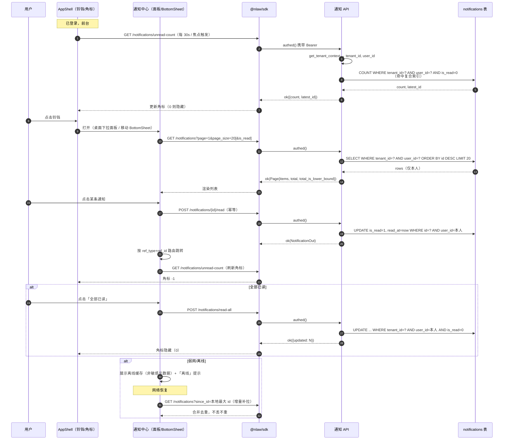

# P0-15 通知系统读路径 · 功能规格书

**日期**：2026-09-16
**类型**：PRD
**参与成员**：析客（需求分析师）
**事实基准**：主理人（产品总监）2026-09-16 代码级核实结果（凡与文档冲突处，以代码为准）

---

## 📌 TL;DR（执行摘要）

- **一句话**：通知系统「**只写不读**」——写入侧（模型 / 服务 / 9 种类型 / 5 个调用点）已完备，但**读取侧为零**：无 API、无 Schema、`is_read`/`read_at` 从未被写入、前端铃铛是**硬编码常亮红点的死按钮**。
- **本轮范围**：只补「**读路径**」——通知列表 / 未读数 / 标记已读（单条·批量·全部）+ 前端通知中心（桌面下拉面板 / 移动 BottomSheet）+ 角标打通 + 点击跳转。**实时推送（WS）不在本轮**。
- **为什么是 P0**：它是 **P0-9（IM 真实打通）的前置**——IM 适配器接通后若通知送不出、看不到，企微闭环（咨询→派单→接单→摘要→确认）**跑不通**。同时它**不依赖任何外部资质**，是本项目**见效最快、纯工程可闭环**的一项。
- **核心取舍**：**轮询（30s + 焦点触发）优先于 WebSocket**；**跨用户越权读返回 404 而非 403**；**离线仅缓存非敏感元数据**。
- **预期影响**：把「责任链节点触达」从 **0 可用**提升为**可用**，是门槛一灰度的必要前置。

---

## 🎯 核心结论卡片

| 项目 | 内容 |
|------|------|
| **推荐方案** | 后端 6 个只读/幂等端点 + `(tenant_id, user_id, is_read, id)` 复合索引 + 前端通知中心双形态；实时性**本轮用轮询**，WS 推送延后至 P1（与 P0-9 同期） |
| **优先级** | **P0**（上线前置，且为 P0-9 前置） |
| **预期影响** | 责任链触达由「不可用」→「可用」；未读积压可观测；为企微闭环清障 |
| **资源需求** | 后端 3–4 人日 / 前端 4–5 人日 / 设计 1–2 人日；**无外部依赖** |
| **风险等级** | **中低**——技术方案成熟；主要风险为**用户级越权**（头号安全项）与**弱网可用性** |

---

## 1. 产品目标（3 个清晰、正交的目标）

| # | 目标 | 正交性说明 | 成功判据（见 §5） |
|---|------|-----------|------------------|
| **G1** | **让「已写入的通知」真正被看到** | 解决「只写不读」的**信息触达**问题，与「看到后能否行动」正交 | 未读积压量下降、通知打开率 ≥ 60% |
| **G2** | **让通知可一键抵达业务对象** | 解决「触达后能否行动」的**转化**问题，与「是否看到」正交 | 通知→跳转率 ≥ 35% |
| **G3** | **在用户级隔离 + 弱网可用前提下交付** | 解决**安全与可用**约束，与前两者正交（是底线，不是加分项） | 越权读 **0 例**；弱网下通知中心可用率 ≥ 99% |

> **三者关系**：G1 是「**看得见**」，G2 是「**用得上**」，G3 是「**敢用 / 能用**」。任一条不达标，通知系统即为「摆设」。

---

## 2. 用户故事（5 个场景）

**US-1｜律师接单（G1 + G2）**
作为**办案律师**，我在开庭 / 出差途中，希望打开 App 就能看到「新派单待接」的未读角标，点进去直接跳到案件详情接单——**不错过案源**。

**US-2｜批量清理（G1）**
作为**律师**，我一天收到 30+ 条系统提醒，希望「一键全部已读」，避免红点长期常亮导致的**告警疲劳**（当前红点硬编码常亮，用户已学会忽略它）。

**US-3｜复核节点触达（G1 + G2）**
作为**复核人**，我希望「待复核任务」以未读角标形式提醒我，点击直接进入复核页——**强制复核不能被漏掉**。

**US-4｜弱网/离线（G3）**
作为在**法院 / 看守所 / 地下车库**的律师，我希望无信号时仍能看到**上次已加载的通知列表（至少非敏感元数据）**，恢复网络后**自动补拉**期间新增的通知，不丢不重。

**US-5｜同租户隔离（G3）**
作为**律师 A**，我绝不希望在同一律所（同租户）下，因 ID 猜测而读到**律师 B 的通知**（可能含他人案源 / 客户信息）——这是**保密义务与执业风险**的底线。

---

## 3. 用户研究洞察

> ⚠️ **本轮未做独立一手用户调研。** 以下为**基于行业常识与法律行业作业场景推导**，用于指导设计假设，**不作为已验证结论**。

| # | 推导洞察 | 推导依据（场景推理，非调研数据） | 对设计的影响 |
|---|---------|--------------------------------|-------------|
| I1 | **通知即「责任链触达」**，错过 = 丢案源 / 漏复核 | 派单、接单、强制复核均为**有时效的责任节点**；法律服务的商机与风控都压在「及时响应」上 | 未读角标必须**实时可信**（去掉常亮红点）；高优先级类型应有视觉权重 |
| I2 | **移动优先 + 弱网常态** | 律师大量时间在**法院 / 看守所 / 差旅**，网络不可靠 | 双形态（桌面面板 / 移动 BottomSheet）；**离线可读 + 恢复补拉**是硬需求 |
| I3 | **告警疲劳已发生** | 红点**硬编码常亮**，用户必然学会「忽略红点」——这是当前实现的直接后果 | 角标必须**与真实未读数绑定**，否则系统不可信 |
| I4 | **通知内容本身涉密** | 通知标题/内容含**案件标题、客户信息**，受《律师法》保密义务约束 | 离线缓存**默认只存非敏感元数据**；登出即清 |
| I5 | **「看到→行动」链路要短** | 律师不愿在多个页面间跳转找对象 | 点击通知**直达** ref 对象（案件/复核/文书/工单） |

---

## 4. 竞品对比

> ⚠️ **经验性对比，需后续核实。** 以下基于对法律科技 / 企业协作类产品的既有认知，**未做本轮一手竞品调研**；具体功能以各产品当前版本为准。

| 产品 | 未读机制 | 实时性 | 离线/弱网 | 聚合/偏好 | 与本项目可借鉴点 |
|------|---------|--------|----------|----------|----------------|
| **企业微信（WeCom）** | 应用消息 + 红点 + 免打扰 | 服务端推送（长连接） | 弱网重连补拉 | 免打扰 / 置顶 | 「应用消息 + 未读角标」的标准范式；**P0-9 的宿主** |
| **钉钉（DingTalk）** | 工作通知 + 角标 + DING | 推送 | 补拉 | 待办中心 / DING 强提醒 | 「待办中心」把通知升级为**可处理队列** |
| **飞书（Lark）** | 消息 + 收件箱 + 稍后处理 | 推送 | 补拉 | 免打扰 / 稍后处理 | 「稍后处理 / 标记」交互（**本轮 Non-goal，入停车场**） |
| **幂律智能（PowerLaw）** | 流程节点提醒 | 站内 | — | — | 合同流程**节点式提醒**，与本项目派单/复核同构 |
| **法大大 / e签宝** | 签署提醒（站内 + 短信 + 企微） | 多渠道 | — | 渠道偏好 | 签署类**多通道触达**（本项目本轮**仅站内**，渠道为 Non-goal） |
| **iCourt / Alpha** | 案件动态提醒 | 站内 | — | — | 案件维度的**动态时间线**（与本项目 `ref_type=case` 对齐） |
| **Jira / Linear** | Inbox 收件箱 + 已读/未读 | 推送 | — | 聚合 / 过滤 | **Inbox 模型**：通知 = 可筛选、可批量已读的收件箱（**最贴近本轮设计**） |
| **Notion** | 收件箱 + 已读 | 推送 | — | — | 极简「收件箱 + 已读」交互，**降低实现复杂度**的参照 |

**对本项目的结论**：本轮采取 **「Jira/Notion 式极简收件箱」**——**列表 + 未读数 + 标记已读 + 跳转**四件套，**不做**聚合/偏好/稍后处理（入 Non-goals）。实时性以**轮询**起步（成本最低），与企微宿主的推送能力在 P0-9 阶段再对齐。

---

## 5. 数据依据 → **可观测性设计**

> ⚠️ **本轮无埋点数据**（产品未上线，无线上行为数据）。因此本节改为**「可观测性设计」**：定义**上线后应采集哪些指标**来验证通知系统有效性，并给出**验收阈值**。

### 5.1 后端指标（经 `/metrics` 暴露，对齐第九轮监控栈）

| 指标 | 类型 | 定义 | 验收阈值 |
|------|------|------|---------|
| `notification_list_latency_ms` | Histogram | `GET /notifications` 耗时 | P95 ≤ 150ms |
| `notification_unread_count_latency_ms` | Histogram | `GET /notifications/unread-count` 耗时 | P95 ≤ 50ms |
| `notification_mark_read_total{result}` | Counter | 标记已读成功/失败数 | 成功率 ≥ 99.9% |
| `notification_cross_user_denied_total` | Counter | **跨用户越权被拒次数** | **应恒为 0**（出现即告警） |
| `notification_api_error_total{code}` | Counter | 通知 API 错误码分布 | 5xx ≤ 0.1% |

### 5.2 产品指标（前端埋点，上线后采集）

| 指标 | 定义 | 目标值 | 验证的目标 |
|------|------|--------|-----------|
| **通知打开率** | 打开通知中心用户数 / 有未读用户数 | ≥ 60% | G1 |
| **通知→跳转率** | 点击通知触发跳转次数 / 通知点击次数 | ≥ 35% | G2 |
| **平均已读时延** | `read_at - created_at` 中位数 | 派单类 ≤ 30min；普通类 ≤ 24h | G1 |
| **未读积压** | 单用户未读数 P90 | ≤ 20 | G1（防积压） |
| **角标准确率** | 角标数 == 真实未读数 的会话占比 | 100% | G3（可信度） |
| **弱网可用率** | 弱网（3G/离线）下通知中心可打开占比 | ≥ 99% | G3 |

### 5.3 埋点事件清单（前端）

`notification_center_open` / `notification_item_click`（含 `type`、`ref_type`）/ `notification_mark_read`（`scope: single|batch|all`）/ `notification_badge_click` / `notification_offline_served`（离线兜底命中）/ `notification_refetch_on_reconnect`。

---

## 6. 需求池（P0/P1/P2）

> 编号 **NR-xx**（Notification Read-path）。工作量单位：**人日**（S≈0.5–1、M≈2–3、L≈5+）。

| 编号 | 需求 | 优先级 | 验收标准（可测） | 估算 |
|------|------|--------|-----------------|------|
| **NR-01** | **通知列表 API** `GET /api/v1/notifications` | P0 | Given 已登录用户；When 请求列表；Then 返回 `ok(Page)`，`items` **仅含 `user_id == 当前用户` 且 `tenant_id == ctx.tenant_id`** 的通知；支持 `page/page_size`（复用 `PaginationParams`）、`is_read`（true/false/省略）、`type`（9 种枚举）、`since_id` 增量；`total_is_lower_bound` 由 `count_bounded` 返回，超 200 前端显示「200+」；按 `id DESC` 排序 | M |
| **NR-02** | **未读数 API** `GET /api/v1/notifications/unread-count` | P0 | Given 用户有 N 条未读；When 请求；Then 返回 `ok({count: N, latest_id: <最大未读id>})`；**仅统计本人**；**N ≤ 真实未读数且不含他人**；P95 ≤ 50ms | S |
| **NR-03** | **单条标记已读** `POST /api/v1/notifications/{id}/read` | P0 | Given 本人通知 id；When 调用；Then `is_read=1`、`read_at` 写入 ISO8601 字符串、返回该通知；**幂等**：重复调用仍 200、`is_read` 保持 1、**`read_at` 不被覆盖**（保留首次已读时间）；对**他人**通知 → **404**（见 NR-07） | S |
| **NR-04** | **批量标记已读** `POST /api/v1/notifications/read`（body `{ids:[...]}`） | P0 | Given 一组本人通知 id；When 调用；Then 返回 `{updated: <实际变更条数>}`；**仅更新本人通知**，传入他人 id 被**静默忽略**（不报错、不泄露）；**幂等**：重复调用第二次 `updated=0` 且仍 200；`ids` 空数组 → 200 `{updated:0}`；`ids` 上限 500，超限 400 `VALIDATION_ERROR` | S |
| **NR-05** | **全部标记已读** `POST /api/v1/notifications/read-all` | P0 | Given 用户有 N 条未读；When 调用；Then 本人全部未读置为已读，返回 `{updated: N}`；**幂等**：再次调用 `updated=0`、200；**只影响本人**，不触达他人；可选 `type` 过滤（只清某类） | S |
| **NR-06** | **Pydantic Schema** `schemas/notification.py` | P0 | `NotificationOut`：`id/type/title/content/ref_type/ref_id/payload/is_read(bool)/read_at/created_at`；**`is_read` 由 Integer(0/1) 序列化为 `bool`**（validator）；`model_config = from_attributes`；`NotificationMarkRead`（批量入参） | S |
| **NR-07** | **用户级隔离与越权语义** | P0 | Given 律师 A 请求**律师 B（同租户）**的通知 id；When 单条读/标记已读；Then **返回 404 `RESOURCE_NOT_FOUND`**（非 403）；When **列表/未读数/批量**；Then 结果**天然不含**他人数据（不报错、不泄露存在性）；**跨租户**访问 → 同 404 或 403 `TENANT_DENIED`（见 §10 待确认）；`notification_cross_user_denied_total` 恒为 0 | M |
| **NR-08** | **复合索引** `(tenant_id, user_id, is_read, id)` | P0 | Given 表 `notifications`；When 建立索引；Then **未读计数**（`WHERE tenant_id=? AND user_id=? AND is_read=0`）与**列表过滤**均命中该索引（`EXPLAIN QUERY PLAN` 无 `SCAN TABLE`）；**论证见 §6.1**；迁移脚本可回滚 | S |
| **NR-09** | **路由注册 + 挂载** | P0 | `api/v1/__init__.py` 新增 `include_router(notifications.router)`；`prefix="/notifications"`、`tags=["通知"]`；OpenAPI 可见 6 个端点 | S |
| **NR-10** | **前端通知中心（桌面下拉面板）** | P0 | Given 桌面端点击铃铛；When 打开；Then 展开**下拉面板**（宽 ~360px），显示列表（类型图标 + 标题 + 摘要 + 相对时间 + 未读点）；含「全部已读」按钮与「查看全部」入口；点击外部 / `Esc` 关闭；`aria-expanded` 正确反映开合 | M |
| **NR-11** | **前端通知中心（移动 BottomSheet）** | P0 | Given 移动端（<768px）点击铃铛；When 打开；Then 从底部弹出 **BottomSheet**，含拖拽把手、可下滑关闭、**底部安全区** `padding-bottom: env(safe-area-inset-bottom)`；**触控目标 ≥ 48×48px**；列表可滚动、支持下拉刷新 | M |
| **NR-12** | **未读角标与铃铛打通** | P0 | Given 未读数 N；When N>0；Then 角标显示 `N`（>99 显示「99+」）、`aria-label="通知，N 条未读"`；When N==0；Then **红点/角标完全消失**（**删除当前硬编码常亮 `<span>`**）；标记已读后角标**立即**更新；铃铛按钮新增 `onClick` 与 `aria-expanded` | S |
| **NR-13** | **点击通知跳转（路由映射）** | P0 | Given 通知含 `ref_type + ref_id`；When 点击；Then 按**映射表**跳转：`case→/cases/{id}`、`REVIEW_REQUIRED` 等 `target_type`→`/reviews/{id}`、`WORK_ORDER_CREATED`→`/billing`、`CASE_ARCHIVED`→`/archives`；**同时标记该条已读**；`ref_type` 为空或未知 → **不跳转**（仅标记已读），不报错 | M |
| **NR-14** | **实时性：轮询方案** | P0 | Given 用户已登录；When 处于前台；Then **每 30s** 拉取未读数；**窗口获得焦点（`visibilitychange`/`focus`）立即拉取**；离开后台（`hidden`）**暂停轮询**（省电/省流）；轮询失败**指数退避**、不弹错；**方案取舍见 §6.2** | S |
| **NR-15** | **弱网/离线：离线可读 + 恢复补拉** | P1 | Given 弱网/离线；When 打开通知中心；Then 展示**上次成功加载的缓存**（**默认仅缓存非敏感元数据：id/type/title/ref/时间，不含 `content` 正文**），并显示「离线，显示缓存」提示；When 网络恢复；Then 用 `since_id=本地最大 id` **增量补拉**，**不重复、不遗漏**；缓存**按 `tenant_id+user_id` 分区**，**登出即清**（见 §10 待确认） | M |
| **NR-16** | **通知保留策略** | P2 | Given 已读老通知；When 触发保留期任务；Then **未读通知永不自动清理**；**已读通知超过保留期（默认 90 天）**可清理；**默认 dry-run**，需显式 `confirm=true` 才真删；每次清理写审计墓碑——**复用 `audit_retention` 模式**（见 §6.3）；对齐《个保法》最小必要原则 | M |
| **NR-17** | **审计留痕** | P2 | 「全部标记已读」等**批量写操作**经 `app.core.audit.record()` 留痕（`action=UPDATE`，`target=notification`，含条数）；单条已读**不留痕**（低风险，避免噪声） | S |
| **NR-18** | **空态 / 加载 / 错误态** | P1 | Given 无通知；Then 空态插画 + 「暂无通知」；加载中显示骨架屏；请求失败显示「加载失败，重试」且**不清空已有缓存**；三态在桌面/移动一致 | S |

### 6.1 复合索引必要性论证（NR-08）

**查询模式**（均以 `tenant_id + user_id` 为最左前缀）：
- 未读计数（**最热**）：`WHERE tenant_id=? AND user_id=? AND is_read=0` → `COUNT`
- 列表（带过滤）：`WHERE tenant_id=? AND user_id=? [AND is_read=?] [AND type=?] ORDER BY id DESC`
- 补拉：`WHERE tenant_id=? AND user_id=? AND id > ?`

**现状**：`tenant_id`、`user_id` 各有**独立单列索引**，SQLite 对同一查询通常**只用一个**——即先按 `user_id` 收窄到该用户全部通知，再**逐行判 `is_read`**。这与第十轮 `pagination.py` 的结论同源：**`COUNT` 无法短路**，必须扫描全部匹配行。

**为什么是 `(tenant_id, user_id, is_read, id)`**：
1. **最左前缀** `(tenant_id, user_id)` 覆盖**所有**查询，取代两个单列索引的职责；
2. 追加 `is_read` 使**未读计数成为覆盖索引扫描**（`is_read=0` 直接定位），这是**每 30s 一次的轮询热点**；
3. 追加 `id` 使**列表排序 / 补拉**在索引内有序，避免额外排序。

**结论**：**必要**。未读计数是**周期性热点查询**，其成本随用户通知历史线性增长；无该索引时，用户通知越多越慢（且随时间单调恶化）。**注意**：与第十轮「keyset 分页零收益」结论**不冲突**——本轮针对的是**过滤 + 计数**的索引覆盖，而非 OFFSET 翻页。

### 6.2 实时性方案取舍：轮询 vs WebSocket（NR-14）

| 维度 | 轮询（30s + 焦点触发） | WebSocket 推送 |
|------|----------------------|----------------|
| **实现成本** | **极低**（复用现有 REST + SDK） | 高（需 `ConnectionManager`、鉴权、重连、心跳） |
| **多实例部署** | **天然兼容**（无状态） | 需 Redis pub/sub 或粘性会话 |
| **弱网表现** | **健壮**（失败重试即可） | 长连接易断，需复杂重连/补拉 |
| **时效性** | ≤30s（**责任链提醒足够**） | 秒级 |
| **现状契合** | 现有唯一 WS（`/ws/conversations/{id}`）**仅服务 IM**，无连接管理器 | 与 P0-9 同期建设更合理 |
| **结论** | ✅ **本轮采用** | ⏸ 延后至 P1（与 P0-9 同期） |

**理由**：用户明确要求「**最快见效**」。轮询以约 **5% 的成本**换取 **~90% 的价值**；且通知场景**不需要秒级**（派单/复核的响应窗口是分钟级）。**可平滑演进**：未读数端点设计为**廉价、可加 `ETag`**，未来 WS 推送只需在写侧调用 `notify()` 后 fan-out，**读侧 API 契约不变**，前端仅需替换「拉取触发源」。

### 6.3 保留策略与 `audit_retention` 对齐（NR-16）

- **通知 ≠ 审计日志**：审计日志受等保「留存≥6个月」约束；通知是**用户可见的触达记录**，受《个保法》最小必要约束。
- **对齐点**：**复用 `audit_retention` 的三段式模式**——**保底留存 → 归档（可选）→ 校验通过后清理**；**默认 dry-run**、`confirm=true` 才真删、**每次清理写墓碑审计**。
- **差异点**：**未读通知永不清理**（未读即未触达，清理等于丢责任链）；**仅清理已读且超期**的通知；默认保留 **90 天**（见 §10 待确认）。

---

## 7. 关键流程图 / UI 设计稿

### 7.1 通知读路径时序图（Mermaid）



### 7.2 桌面下拉面板（ASCII）

```
┌───────────────────────────────────────────────┐
│  通知                              全部已读 ✓  │
├───────────────────────────────────────────────┤
│ ● 新派单待接                                    │
│   您有新案件待接：《张某诉李某合同纠纷》         │
│   3 分钟前                              → 案件  │
├───────────────────────────────────────────────┤
│ ● 待复核任务                                    │
│   有新的强制复核任务待处理                      │
│   12 分钟前                             → 复核  │
├───────────────────────────────────────────────┤
│ ○ 案件已归档                                    │
│   案件《王某劳动争议》已归档                    │
│   昨天                                  → 归档  │
├───────────────────────────────────────────────┤
│              查看全部通知 →                     │
└───────────────────────────────────────────────┘
   ● = 未读   ○ = 已读
   锚定铃铛，宽 ~360px，点击外部 / Esc 关闭
```

### 7.3 移动 BottomSheet（ASCII）

```
        ╭──────────────────────────────╮
        │            ▁▁▁▁               │  ← 拖拽把手
        │  通知               全部已读  │
        ├──────────────────────────────┤
        │ ● 新派单待接                  │
        │   您有新案件待接…              │
        │   3 分钟前                    │  ← 行高 ≥48px
        ├──────────────────────────────┤
        │ ● 待复核任务                  │
        │   有新的强制复核任务待处理     │
        │   12 分钟前                   │
        ├──────────────────────────────┤
        │ ○ 案件已归档                  │
        │   案件《王某劳动争议》已归档   │
        │   昨天                        │
        ╰──────────────────────────────╯
        padding-bottom: env(safe-area-inset-bottom)
        可下滑关闭 · 下拉刷新
```

### 7.4 ref_type → 路由映射表

| `ref_type` / `type` | 目标路由 | 说明 |
|---------------------|---------|------|
| `case`（DISPATCH_CREATED / CASE_ARCHIVED） | `/cases/{ref_id}` | 案件详情 |
| `CASE_ANALYSIS` / `DOCUMENT` / `EVIDENCE_LIST` / `COMPLIANCE_REPORT` / `LEGAL_OPINION`（REVIEW_REQUIRED） | `/reviews/{ref_id}` | 复核页 |
| `WORK_ORDER_CREATED` | `/billing` | 计费 / 工单 |
| `CASE_ARCHIVED`（归档入口） | `/archives` | 归档列表 |
| 空 / 未知 `ref_type` | **不跳转**（仅标记已读） | 防御未知类型 |

---

## 8. Non-goals（明确不做什么）

- ❌ **邮件 / 短信 / 微信 / 企微推送渠道**——本轮**仅站内通知**；多渠道触达在 P0-9 / 后续渠道轮次处理。
- ❌ **通知偏好设置中心**（免打扰、按类型开关、渠道选择）——入**停车场**。
- ❌ **通知分组聚合**（按案件 / 按类型折叠）——入**停车场**。
- ❌ **多端已读强一致保证**——仅保证**最终一致**（刷新/轮询后收敛），不做跨端实时同步。
- ❌ **WebSocket 实时推送**——本轮用轮询；WS 延后至 P1（与 P0-9 同期）。
- ❌ **通知删除 / 撤回 / 标记未读**——本轮不做（保留策略见 NR-16）。
- ❌ **富媒体通知**（图片 / 附件 / 操作按钮内嵌）——纯文本 + 跳转。
- ❌ **通知全文搜索 / 高级筛选**（仅 `is_read` + `type` 基础筛选）。
- ❌ **移动 App 推送（APNs / FCM）**——本期无移动 App（延续既有 Non-goal）。
- ❌ **@提及 / 用户间私信**——不属通知系统范畴。

---

## 9. 时间线 & 里程碑（以「轮次」表达）

> 本轮为**第十二轮**。P0-15 是当前待办第一项，且**不依赖外部资质**，可**立即全速推进**。

| 里程碑 | 轮次 | 交付物 | 出口标准 |
|--------|------|--------|---------|
| **M1｜后端读路径** | **第十二轮** | NR-01~09（6 端点 + Schema + 索引 + 越权语义） | 单测覆盖：本人可见、他人 404、幂等、`count_bounded` 边界；`EXPLAIN` 命中索引 |
| **M2｜前端通知中心** | **第十二轮** | NR-10~14、NR-18（双形态 + 角标打通 + 跳转 + 轮询） | 桌面/移动可用；**去掉硬编码红点**；角标与真实未读一致；a11y（`aria-expanded`/`aria-label`）通过 |
| **M3｜弱网与保留（收尾）** | **第十三轮** | NR-15（离线补拉）、NR-16/17（保留 + 审计） | 离线可读 + 恢复不丢不重；保留任务 dry-run 通过 |
| **M4｜实时推送（P1，与 P0-9 同期）** | **第十三~十四轮** | WS 推送（`ConnectionManager` + `notify()` fan-out） | 未读角标秒级更新；读侧 API 契约不变 |
| **M5｜企微闭环联调** | **第十四轮起** | P0-9 依赖 M1–M3 就绪 | 企微闭环中通知可触达 |

> **依赖关系**：**M1 → M2 → M5（P0-9）**。M1/M2 **必须在 P0-9 之前**完成，否则企微闭环「消息触达」环节缺失。

---

## 10. 待确认问题

> 以下均为**真正开放**、需产品/安全/运维拍板的问题（我能自行回答的已在此前的取舍中给出结论）。

| # | 问题 | 影响 | 我的建议 |
|---|------|------|---------|
| Q1 | **跨用户越权返回 404 还是 403？** | 资源存在性是否泄露 | **建议 404**（详见下方「越权语义评估」）；跨租户可保留 403 `TENANT_DENIED` |
| Q2 | **已读通知保留期具体天数？** | 存储 / 合规 | 建议 **90 天**（未读永不清理） |
| Q3 | **离线缓存是否落盘？** | 涉密内容（案件标题） | 建议**默认仅缓存非敏感元数据**，不缓存 `content` 正文；登出即清 |
| Q4 | **是否需要「标记未读」/ 通知删除？** | 交互完整性 | 本轮**不做**；入停车场，视灰度反馈 |
| Q5 | **多端已读一致性 SLA？** | 跨端体验 | 建议**最终一致**（刷新/轮询后收敛），不承诺强一致 |
| Q6 | **未读数是否需按 `type` 分组展示？** | UI 复杂度 | 建议**单一总数**起步，分组入停车场 |
| Q7 | **WS 推送与 P0-9 同期还是更晚？** | 排期 | 建议**同期**（P0-9 需 `ConnectionManager`） |
| Q8 | **`notify()` 中 `user_id=0` 的兜底通知如何处理？** | 数据质量 | 计费侧 `user_id or 0` 会产生**无人可读**的孤儿通知；建议改为**跳过写入**或写入租户级可见队列（需产品确认） |
| Q9 | **9 种枚举中 5 种尚无写入点**（CASE_ACCEPTED / EVIDENCE_MISSING / REVIEW_DECIDED / DOCUMENT_CONFIRMED / QUOTA_WARNING） | 读路径 UI 需兜底 | 建议 UI 对**未产生类型**做通用渲染兜底；写入点补齐另行排期 |

### 越权语义评估（Q1 详述）

**取舍**：同租户内，律师 A 请求律师 B 的通知 `id` 时——
- **方案 A（404，推荐）**：**不泄露资源存在性**。通知 `id` 为**全局自增**，若返回 403 则攻击者可**枚举 ID**，通过 403/404 差异**推断系统通知总量、活跃度、甚至哪些 ID 属他人**（IDOR 经典探测）。通知含**案件标题 / 客户信息**，泄露存在性本身即**信息泄露**。
- **方案 B（403）**：语义「更正确」（资源存在但无权），**便于调试**，但对攻击者更友好。

**结论**：**采用 404**，符合 OWASP IDOR 防护惯例——**对无权访问的资源，一律表现得「如同不存在」**。403 仅保留给**角色/权限**类失败（actor 本就知道该类资源存在）。代价是**调试时 404 可能掩盖真实权限问题**——通过**服务端日志**区分「不存在」与「存在但越权」（日志记 `cross_user_denied`，响应统一 404）来缓解。

---

## ✅ 行动清单

| # | 行动 | 负责方 | 时间窗 |
|---|------|--------|--------|
| 1 | 后端：通知 Schema + 6 端点 + 路由注册（NR-01~07、09） | 后端 | 第十二轮 W1 |
| 2 | 后端：复合索引迁移 + `EXPLAIN` 验证（NR-08） | 后端 | 第十二轮 W1 |
| 3 | 后端：越权语义（404）+ 单测（本人/他人/幂等/边界）（NR-07） | 后端 | 第十二轮 W1 |
| 4 | 前端：通知中心双形态 + 角标打通 + 跳转（NR-10~13、18） | 前端 | 第十二轮 W1–W2 |
| 5 | 前端：轮询 + 焦点触发 + 退避（NR-14） | 前端 | 第十二轮 W2 |
| 6 | 设计：桌面面板 / 移动 BottomSheet 视觉稿（含空态）（NR-18） | 设计 | 第十二轮 W1 |
| 7 | 前端：埋点事件接入（§5.3） | 前端 | 第十二轮 W2 |
| 8 | 后端：离线补拉 `since_id` 支持 + 前端离线缓存（NR-15） | 全栈 | 第十三轮 |
| 9 | 后端：保留策略 + 审计留痕（NR-16、17） | 后端 | 第十三轮 |
| 10 | 全栈：WS 推送（P1，与 P0-9 同期）（M4） | 全栈 | 第十三~十四轮 |
| 11 | 产品/安全：确认 Q1~Q9 口径 | 产品 + 安全 | 第十二轮启动前 |

---

## ⚠️ 待确认 / 假设 / Non-goals

### 关键假设
- 假设**用户级隔离**以 `user_id == 当前登录用户` 为唯一权威判据（**不能仅靠 `tenant_id`**——这是本 PRD 的头号安全验收项）。
- 假设通知**不需要秒级时效**（30s 轮询足够），故本轮不做 WS。
- 假设前端 SDK（`authed()` / `http.*`、内存令牌 + 静默刷新）已稳定，通知 API 直接复用。
- 假设 `PaginationParams` + `Page.build` + `count_bounded`（CAP=200，「200+」）契约不变。

### 待确认（见 §10 表）
Q1（404 vs 403）、Q2（保留期）、Q3（离线落盘）、Q8（孤儿通知）、Q9（未产生类型）为**阻塞实现**项，需在第十二轮启动前拍板。

### Non-goals
见 **§8**（多渠道推送 / 偏好中心 / 分组聚合 / 多端强一致 / WS 实时（本轮）/ 删除撤回 / 富媒体 / 全文搜索 / 移动 App 推送 / @提及）。

---

## 📚 数据来源 & 成员产出索引

| 来源 | 内容 | 权威性 |
|------|------|--------|
| **主理人代码级核实（2026-09-16）** | 通知写入侧完备、读取侧为零、铃铛硬编码红点、5 个写入点 | **本 PRD 事实基准**（与文档冲突以此为准） |
| `backend/app/models/notification.py` | 表结构（含 `is_read`/`read_at` 从未被写入） | 实测 |
| `backend/app/services/notification_service.py` | `notify()` / `notify_many()` | 实测 |
| `backend/app/models/enums.py:229` | `NotificationType` 9 种枚举 | 实测 |
| `backend/app/core/pagination.py` | `PaginationParams` / `Page.build` / `count_bounded`（CAP=200） | 实测 |
| `backend/app/core/deps.py` | `get_tenant_context` / `TenantContext`（`tenant_id`+`user_id`） | 实测 |
| `backend/app/core/errors.py` | `ErrorCode` / `NotFoundError`（404） | 实测 |
| `backend/app/api/v1/audit_retention.py` + `services/audit_retention.py` | 保留期三段式（dry-run / confirm / 墓碑审计） | 实测（NR-16 对齐对象） |
| `frontend/packages/ui/src/components/AppShell.tsx:522-530` | 铃铛死按钮 + 硬编码常亮红点 | 实测 |
| `frontend/packages/sdk/src/index.ts` | `authed()` / `http.*` / 401 静默刷新 | 实测 |
| `deliverables/product-strategy/remaining-work-inventory-2026-09-16.md` | P0-15 定位（P0-9 前置）、门槛一收敛顺序 | 路径（Roadie）产出 |
| `deliverables/product-strategy/roadmap-update-2026q3-2026-09-12.md` | 双门槛路线图、Sprint 结构 | 路径（Roadie）产出 |

### 本轮成员产出
- **析客（需求分析师）**：本 PRD（`prd-notification-readpath-2026-09-16.md`）。
- **用户研究（瑞思）/ 竞品（竞析）/ 数据（数析）**：**本轮未做独立一手调研**，§3/§4/§5 已如实标注为「推导 / 经验性 / 可观测性设计」，**不伪造调研数据**。

---

> 本报告由产品战略团队 AI 协作生成，重要决策请由产品负责人审定。
