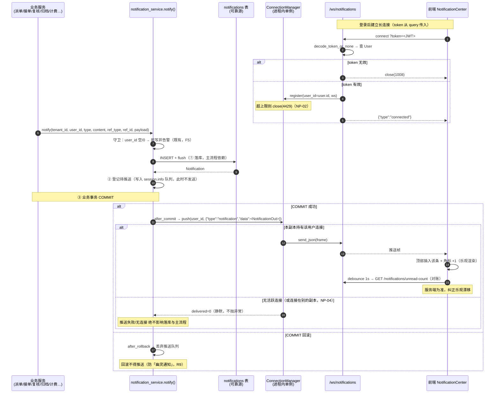
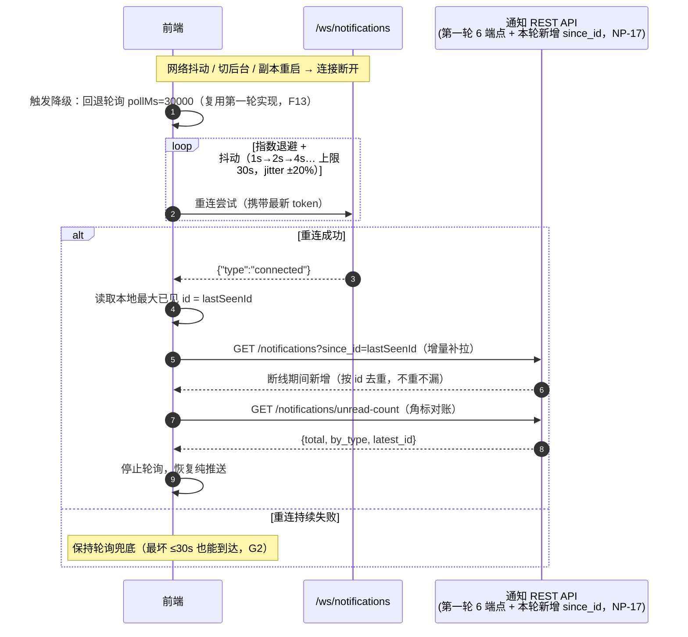
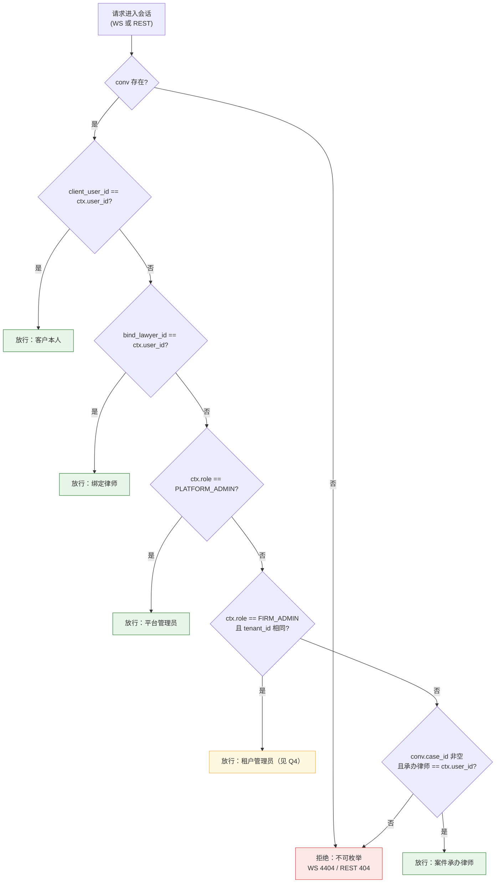

# P0-15 通知系统 · 第三轮：实时推送链路 · 功能规格书

**日期**：2026-09-16
**类型**：PRD
**参与成员**：析客（需求分析师）
**事实基准**：主理人（产品总监）2026-09-16 代码级核实结果（凡与文档冲突处，以代码为准）
**承前**：`prd-notification-readpath-2026-09-16.md`（第一轮读路径）、`round12-notification-overview.md`（第一轮交付记录）、`round12b-notification-producers-overview-2026-09-16.md`（第二轮写入点）

---

## 📌 TL;DR（执行摘要）

- **一句话**：通知现在**只能轮询**（30s + 焦点触发 + 指数退避），**没有任何实时推送能力**。即使 P0-9 企微适配器接通，通知也**送不出去**。
- **为什么现在做**：门槛一（可试点版）的出口标准是「真实企微跑通『咨询→派单→接单→AI 摘要→律师确认』闭环」，该闭环的**消息触达依赖推送**。而 P0-9 卡在**企微服务商资质**（外部依赖，尚未启动）——这是全项目最长的关键路径。**现在把推送链路建好，等资质落地时链路即已就绪**，避免「工程做完了，资质还没批」的空转。
- **本轮范围**：`ConnectionManager`（用户级连接注册表）+ `notify()` **双写**（落库 → **事务提交后**推送，推送失败绝不阻断主流程）+ **鉴权 WS 端点** `/ws/notifications` + **会话归属校验缺陷收口**（`ws.py:63`）+ **读侧新增 `since_id` 增量补拉**（第一轮 NR-15 收口）+ 前端从轮询切换 WS 并保留**降级回轮询**。
- **核心取舍**：**推送是 best-effort 的「唤醒信号」，落库才是可靠源**——且推送**锚定在事务 `COMMIT` 之后**（回滚不推，防「幽灵通知」）；**v1 采用进程内单实例语义**（多副本不保证跨实例推送，为已知限制，Redis 已具备依赖但跨副本编排延后）；**越权一律拒绝且不可枚举**（沿用第一轮 404 语义）；**WS 只推当前登录用户自己的通知**，**不支持订阅任意 `user_id`**。
- **头号安全项**：`ws.py:63` 的会话归属判据当前等价于「**同租户内任意用户可进入同租户任意会话**」；叠加 `POST /auth/register` 把所有自助注册客户放进**同一个默认租户**，等于「**任意注册客户可进入任意其他客户的会话**」。本轮必须收口。

---

## 🎯 核心结论卡片

| 项目 | 内容 |
|------|------|
| **推荐方案** | 新增 `ConnectionManager`（`user_id → set[WebSocket]`）+ `notify()` **事务提交后** best-effort 推送 + 鉴权 WS `/ws/notifications` + 会话归属判据**单一来源**化 + 读侧 `since_id` 增量补拉（NP-17）+ 前端 `NotificationCenter` 接 WS 并以轮询为降级 |
| **优先级** | **P0**（门槛一消息触达的必要前置；且为 P0-9 的关键路径清障） |
| **预期影响** | 通知触达由「**≤30s 轮询**」提升为「**秒级推送**」；企微闭环的「消息触达」环节具备可用链路 |
| **资源需求** | 后端 ~2 人日 / 前端 ~1.5 人日；**零新增依赖**（`websockets==13.1`、`redis==5.0.8` 已在 `requirements.txt`） |
| **风险等级** | **中**——长连接的生命周期管理（连接数、心跳、重连）是新引入的复杂度；头号风险为**连接数放大导致资源耗尽**与**多副本推送丢失**（已定级为已知限制 + 降级兜底） |

---

## 1. 产品目标（3 个清晰、正交的目标）

| # | 目标 | 正交性说明 | 成功判据（见 §5） |
|---|------|-----------|------------------|
| **G1** | **让责任链节点「秒级可达」** | 解决**触达时效**问题，与「送达是否可靠」正交 | 推送延迟 P95 ≤ 1s；派单类通知「落库→角标更新」中位时延 ≤ 3s |
| **G2** | **让推送链路「可降级、可自愈」** | 解决**可用性**问题（弱网 / 断线 / 多副本），与「是否秒级」正交 | 断线重连成功率 ≥ 99%；推送不可用时**自动回退轮询**，通知可用率 ≥ 99.9% |
| **G3** | **让长连接「不成为新的越权面」** | 解决**安全与资源**约束，与前两者正交（是底线，不是加分项） | WS 越权推送 **0 例**；会话越权进入 **0 例**；单用户连接数不超上限 |

> **三者关系**：G1 是「**送得快**」，G2 是「**送得到**」，G3 是「**敢开这个口子**」。长连接一旦引入，既是**能力**也是**攻击面与资源面**——G3 不达标，G1/G2 的收益不足以覆盖风险。

---

## 2. 用户故事（5 个场景）

**US-1｜律师在派单池等新派单（G1）**
作为**办案律师**，我在开庭间隙把派单池页面挂在后台，希望**新派单落库的瞬间**角标就跳动、列表就刷新——而不是每 30 秒才可能看到一次。**案源是有时效的，晚 30 秒可能就被同事接走了。**

**US-2｜客户等律师接单（G1）**
作为**客户**，我提交咨询后盯着页面等「谁接了我的案子」，希望律师接单那一刻**立即**收到「案件已接单」提示，而不是反复手动刷新。**等待中的不确定感本身就是流失点。**

**US-3｜复核结论到达（G1）**
作为**承办律师**，我希望复核出结论（需返修 / 已作废 / 可定稿）时**立即**收到提醒——**强制复核的结论直接决定我下一步能不能动**，晚知道就等于卡住。

**US-4｜多端同时在线（G1 + G3）**
作为**律师**，我同时开着办公电脑（桌面端）与手机（移动端）——希望**两端都收到**推送，且**不会因为多开标签页把服务端连接数打爆**；如果我在其中一端读掉了通知，另一端**不必强一致**，但刷新后应**收敛**。

**US-5｜弱网 / 断线重连（G2）**
作为在**法院 / 看守所 / 地下车库**的律师，长连接**必然频繁断开**。我希望：断线期间**自动回退到轮询**（通知照常到达，只是慢一点）；网络恢复后**自动重连**并**补拉**断线期间遗漏的通知——**不丢、不重、不弹错**。

---

## 3. 事实基准（代码级核实，2026-09-16）

> 本节为**事实基准**，非需求。凡与既有文档冲突处，以本节代码事实为准。**本节结论均由主理人实测确认，本轮不改动。**

| # | 事实 | 证据 | 对本轮的意义 |
|---|------|------|-------------|
| F1 | **全库无 `ConnectionManager`** | `grep -rn "ConnectionManager\|connection_manager\|active_connections" app/` → 零命中 | 需**从零**新建连接注册表 |
| F2 | 现有 WS `backend/app/api/v1/ws.py`（91 行）是**「逐会话回显循环」** | 路由 `@router.websocket("/conversations/{conversation_id}")`，`prefix="/ws"`；主体 `while True: receive_text() → 落库 Message → ConversationEngine.process() → send_json` | 它**只回复发消息的那个客户端**，**无 socket 注册表**，**无法主动推送** |
| F3 | 现有 WS **无心跳/保活**；`except WebSocketDisconnect` 只记日志 | `ws.py:89-90` | 死连接不会及时回收 → 需新增心跳 + 超时断开 |
| F4 | `notify()` 是通知的**唯一写入入口** | `notification_service.notify(db, *, tenant_id, user_id, type, content, ref_type=None, ref_id=None, payload=None) -> Optional[Notification]` | 双写应**收敛在此一处**，不在各调用点分散实现 |
| F5 | `notify()` 已有**无接收人守卫**（`user_id` 空/0 → 拒写并告警）与 **try/except 兜底**（失败仅 `logger.warning`，返回 `None`） | `notification_service.py:67-93` | 双写必须**延续**「失败不阻断主流程」这一既有契约 |
| F6 | `NotificationType` 共 9 种，定义于 `models/enums.py:229` | `DISPATCH_CREATED / CASE_ACCEPTED / EVIDENCE_MISSING / REVIEW_REQUIRED / REVIEW_DECIDED / DOCUMENT_CONFIRMED / CASE_ARCHIVED / QUOTA_WARNING / WORK_ORDER_CREATED` | 推送**不改变**类型语义（Non-goal） |
| F7 | `Notification` 模型字段：`id / tenant_id / user_id / type / title / content / ref_type / ref_id / payload / is_read / read_at`，有 `title`（由 `_TITLE` 按类型生成） | `models/notification.py` | 推送消息体可直接复用 `NotificationOut` |
| F8 | **会话归属校验缺陷**：`ws.py:63` 为 `if conv is None or (conv.tenant_id != user.tenant_id and conv.client_user_id != user.id):` | 放行条件 = `tenant 相同` **或** `是本会话客户` → **同租户任意用户可进入同租户任意会话** | 本轮必须收口（NP-09） |
| F9 | REST 侧既有模式不一致：列表接口在 `tenant_id` 之上**当角色为客户时**额外加 `client_user_id == ctx.user_id`（`conversations.py:50-52`）；详情 / 发消息接口仅 `conv.tenant_id != ctx.tenant_id`（`conversations.py:82`、`104`） | 见 `conversations.py` | 归属判据**三处各写一份且不一致** → 需抽**单一来源** |
| F10 | **风险放大点**：`POST /auth/register` 是**公开自助注册**，角色固定 `Role.CLIENT`、租户固定默认租户（防自助提权） | `auth.py:67-82`；`schemas/auth.py:33-46` | **所有自助注册客户落在同一默认租户** → F8 的缺陷等于「任意注册客户可进入任意其他客户的会话」 |
| F11 | `Conversation` 字段：`id / tenant_id / client_user_id / external_user_id / channel / status / bind_lawyer_id / case_id / context / last_message_at` | `models/conversation.py:20-50` | 判据可用字段齐备（客户本人 / 绑定律师 / 关联案件） |
| F12 | 前端通知中心 `NotificationCenter.tsx` 已预留 `pollMs?: number`，注释写明「默认 30000；**传 0 关闭轮询（如已接 WebSocket）**」 | `NotificationCenter.tsx:39` | **组件已为 WS 预留关闭轮询的开关** → 接入成本低 |
| F13 | 轮询实现已含：`visibilitychange` 暂停 / 恢复立即拉取 / 失败指数退避（上限 5min）；列表只在打开面板或 `latest_id` 变化时重拉 | `NotificationCenter.tsx:298-336` | **降级回轮询可零新增代码**（复用现有实现） |
| F14 | `AppLayout` 已把 `notifications?: { href, allHref?, pollMs? }` 透传给 `AppShell` | `AppLayout.tsx:47-52, 92-102` | 前端接入只需在调用方追加 WS 开关，不改组件契约 |
| F15 | `websockets==13.1`、`redis==5.0.8` **已在 `requirements.txt`**；`REDIS_URL: Optional[str] = None` 为**可选**配置 | `requirements.txt:21,54`；`config.py:77` | 跨副本编排**无需新增依赖**；Redis 后端已有**自动降级内存**的成熟范式（`rate_limit_backend.py`） |
| F16 | 应用生命周期钩子 `lifespan(app)` 存在 | `main.py:47, 84` | `ConnectionManager` 单例可挂载于此（启动初始化、关闭时清空） |
| F17 | **全库无 `since_id`**：`grep -rn "since_id" app/` 零命中；`GET /notifications` 实际签名仅 `PaginationParams` + `is_read` + `type` | `api/v1/notifications.py:70-76` | `since_id` 是**第一轮 NR-15 的待办、未实现**（`round12-notification-overview.md` 行动清单第 8 项「⏳ 待办」）→ 本轮需**新增**（NP-17） |

### 3.1 第一轮 / 第二轮的结论在本轮的延续

- **第一轮**：确立「用户级隔离」原则——**归属约束单一来源**、**越权一律 404 不 403**（避免枚举）、**`user_id` 只取自 JWT 不接受请求参数**。本轮**同类问题必须复用**（NP-07 / NP-09）。
- **第一轮 §6.2** 明确：「WS 推送只需在写侧调用 `notify()` 后 fan-out，**读侧 API 契约不变**，前端仅需替换『拉取触发源』」——**本轮正是兑现这一演进路径**：读侧 6 个端点**行为不变**，**仅新增一个向后兼容的可选 `since_id` 查询参数**（NP-17，属第一轮 NR-15 收口）。
- **第二轮**：确立「旁路写入失败不影响主流程」——本轮推送同样必须是**旁路**（NP-05）。

---

## 4. 需求池（P0 / P1 / P2）

> 编号 **NP-xx**（Notification Push）。工作量单位：**人日**（S≈0.5–1、M≈2–3、L≈5+）。
> 术语沿用第一轮：`ctx.tenant_id` / `ctx.user_id` 来自 `get_tenant_context`；越权语义统一 **404 / 不可枚举**。

### 4.1 后端 · 连接管理器（G1 + G3）

| 编号 | 需求 | 优先级 | 验收标准（可测） | 估算 |
|------|------|--------|-----------------|------|
| **NP-01** | **`ConnectionManager` 核心结构**：`user_id → 该用户的活跃连接集合`；支持多端 / 多标签页 | P0 | 给定 `ConnectionManager` 实例；When `register(user_id=7, ws_a)` 与 `register(user_id=7, ws_b)`；Then `push(7, msg)` 使 **ws_a 与 ws_b 均收到**；`push(8, msg)` **不**触达 user 7 的连接；`user_id → set` 内**无重复**（同一 ws 重复注册幂等）；对外**只暴露 `register / unregister / push / count / close_all`**，**不暴露「按任意 user_id 批量查连接」的接口**（防误用成广播） | M |
| **NP-02** | **单用户连接数上限**（防资源耗尽） | P0 | 上限常量 `MAX_CONNECTIONS_PER_USER`（建议 **5**，见 Q2）；When 用户第 6 个连接尝试注册；Then **拒绝新连接**（关闭码 **4429**，见 Q3）且**既有 5 个连接不受影响**（不驱逐活跃会话）；`connection_rejected_total{reason="limit"}` +1；上限值可由配置覆盖，测试可注入 | S |
| **NP-03** | **断连自动清理 + 并发安全** | P0 | When 连接关闭（正常 / 异常 / 超时）；Then `unregister` 在 `finally` 中执行，集合内**不残留**该 ws；集合为空时**删除该 `user_id` 键**（防内存泄漏——空集合长期驻留是隐性泄漏）；`register/unregister/push` 对同一 `user_id` 的集合操作经 **`asyncio.Lock` 保护**；**锁粒度：锁内只取连接快照（拷贝 set），`send_json` 在锁外逐个发送**——`send_json` 是网络 IO，**持锁发送会让一个慢客户端阻塞所有用户的推送**，把「某个用户网络差」放大成「全站推送卡住」；快照方案下发送期间的 `unregister` 是安全的（遍历的是副本，且摘除操作幂等）；When `push` 期间某连接 `send_json` 抛异常；Then **静默摘除该连接**、**继续推送其余连接**、**不向调用方抛异常**；`active_connections` 计数在 100 次注册/注销循环后**回到 0**（无泄漏断言） | M |
| **NP-04** | **进程内单实例语义 + 多副本取舍** | P0 | 明确声明：`ConnectionManager` 为**进程内单例**（挂载于 `main.py` 的 `lifespan`，F16）；**多副本部署下，推送只在持有该连接的副本内生效**；Given 2 副本、用户连接落在副本 A；When 副本 B 调用 `notify()`；Then **副本 B 推送 0 条**（已知限制，**必须**在 ① 代码注释 + ② 本文档 + ③ **运维文档**三处显式声明）；⚠️ **仓库当前无运维手册——「运维文档」是本轮必须新增的产出**（建议 `docs/ops/notification-realtime.md`，见 §10 行动清单第 13 项），否则本条的第三处声明**无法被满足**；降级保障：**前端轮询兜底**（NP-11）保证「最坏 ≤30s 也能到达」；跨副本编排见 **NP-13（P1）** | S |
| **NP-05** | **`notify()` 双写**：先落库（既有行为**不变**）→ **事务提交后**再推送 | P0 | Given 业务动作调用 `notify()`；Then 顺序为 **① 守卫（无接收人拒写）→ ② `db.add` + `flush` 落库 → ③ 登记待推送（写入 `session.info` 队列，此时**不发送**）→ ④ 事务 `COMMIT` 成功后由 `after_commit` 事件真正发送**；**推送发生在事务提交成功之后**；**事务 `rollback` 时由 `after_rollback` 事件丢弃队列——回滚不得产生任何推送**（见下方「为什么不是 `flush` 后推送」）；When 推送抛异常 / 无活跃连接；Then **落库与提交结果不受影响**、**调用方不感知异常**、`notify()` 仍返回该 `Notification`（或 `None` 仅当落库失败）；**`notify_many()` 逐用户登记**（每个 `user_id` 独立入队）；**既有「无接收人拒写」守卫与 try/except 契约保持不变**（F5） | M |
| **NP-06** | **推送消息体契约**（与 `NotificationOut` 一致，避免前端两套解析） | P0 | 推送帧形如 `{"type": "notification", "data": <NotificationOut>}`；`data` **字段集与 `GET /notifications` 返回的 item 完全一致**（`id/type/title/content/ref_type/ref_id/payload/is_read/read_at/created_at`，`is_read` 为 `bool`）；前端**复用同一 `NotificationItem` 类型与 `TYPE_META` 渲染**，**不得**为推送单独写一套解析；`type` 字段与业务 `type`（通知类型）**命名空间隔离**（外层 `type` 是**帧类型**，内层 `data.type` 才是通知类型——**避免同名歧义**，见 Q6）；另定义控制帧 `{"type":"connected"}` / `{"type":"pong"}` / `{"type":"error","message":...}` | S |

**为什么不是「`flush` 后推送」（NP-05 关键取舍）**：`flush` 只把 INSERT 发进**事务**，**并未提交**。调用方随后 `rollback`（校验失败 / 并发冲突 / 下游异常）时，该行**会被撤销**——若在 `flush` 后就推送，客户端会收到「您有新派单待接」，点进去**案件不存在**。这类「**幽灵通知**」不报错、不留日志、只在特定失败路径出现，**直接摧毁用户对通知的信任**，与项目历史上反复出现的「错误结果不报错」是同一类静默错误（见 §9 R9）。因此**推送必须锚定在 `COMMIT` 之后**。代价是 `notify()` 不再同步发送，而依赖 SQLAlchemy 的 `after_commit` / `after_rollback` 事件——**落库仍走既有 `flush` 路径，主流程时序不变**。

### 4.2 后端 · 鉴权 WS 端点（G1 + G3）

| 编号 | 需求 | 优先级 | 验收标准（可测） | 估算 |
|------|------|--------|-----------------|------|
| **NP-07** | **鉴权 WS 端点 `/ws/notifications`** | P0 | 路由 `@router.websocket("/notifications")`（`prefix="/ws"`，与 F2 的 `ws.py` 同 router 或新 router 均可，需在 `api/v1/__init__.py` 注册）；**鉴权**：从 query 取 `token` → `decode_token_or_none` → 查 `User`（**复用 F2 的 `_auth_user` 模式**）；token 缺失/无效 → **不 `accept()` 或 accept 后立即关闭 1008**（沿用 F2 语义）；**连接建立后 `register(user_id=user.id, ws)`**；**只推送该 `user_id` 自己的通知**——`ConnectionManager.push` 的键**只取自 JWT 派生的 `user.id`**，**端点不接受任何「订阅某 user_id / 订阅某 topic」的入参**（越权订阅是头号风险，必须从 API 形状上杜绝）；Given 用户 A 连接；When 系统为 B 写入通知；Then **A 收不到任何帧**（端到端断言）；`user_id` 与 `tenant_id` 均**只取自 JWT**，与第一轮「不接受请求参数」原则一致 | M |
| **NP-08** | **心跳 / 保活 / 超时断开** | P0 | **服务端主动心跳**：每 `HEARTBEAT_INTERVAL`（建议 **30s**）发送 `{"type":"ping"}`；客户端回 `{"type":"pong"}`（或应用层忽略，仅依赖协议层 pong）；**空闲超时** `IDLE_TIMEOUT`（建议 **90s** = 3 × 心跳）未收到任何客户端帧 → **主动 `close(1001)`** 并 `unregister`；**心跳不写库、不触发业务**；When 连接因网络中断「假活」（TCP 未收到 FIN）；Then 至多 `IDLE_TIMEOUT` 后被回收（断言：模拟静默连接，90s 后 `active_connections` 归零）；参数化（测试可缩短到毫秒级） | M |

### 4.3 后端 · 会话归属校验收口（G3，头号安全项）

| 编号 | 需求 | 优先级 | 验收标准（可测） | 估算 |
|------|------|--------|-----------------|------|
| **NP-09** | **会话归属判据「单一来源」化并修正 `ws.py:63`** | P0 | 抽取**唯一判据函数** `can_access_conversation(conv, ctx, *, case_owner_id=None) -> bool`（建议置于 `app/services/conversation_access.py` 或 `conversation_service`），**WS 与 REST 三处（列表 / 详情 / 发消息）共用**，消除 F9 的「三处各写一份」；**放行判据（满足任一）**见 §4.4 表；**未放行一律拒绝且不可枚举**——WS 侧**关闭码 4404**（对齐第一轮 404 语义）、REST 侧维持 **404**（`CONVERSATION_NOT_FOUND`）；Given 同租户非相关律师 C（既非客户本人、非绑定律师、非承办律师、非管理员）；When 通过 WS 或 REST 访问该会话；Then **拒绝**（WS 4404 / REST 404），且**响应与「会话不存在」完全一致**；**回归断言**：第一轮 6 个通知端点与既有会话用例**全部保持通过** | M |

### 4.4 会话归属判据（NP-09 详述）

**问题**：谁应该能进入一个会话？必须**明确列举并说明理由**，不能只按 `tenant_id` 放行。

| # | 身份 | 是否放行 | 判据 | 理由 |
|---|------|---------|------|------|
| 1 | **客户本人** | ✅ | `conv.client_user_id == ctx.user_id` | 会话就是他的，**这是唯一无争议的放行** |
| 2 | **该会话绑定律师** | ✅ | `conv.bind_lawyer_id == ctx.user_id` | 扫码 / 名片绑定（PRD 要求 100% 绑定正确）；绑定关系即服务关系 |
| 3 | **关联案件的承办律师** | ✅ | `conv.case_id` 非空 → 该 `case` 的承办律师 `== ctx.user_id` | 会话已升级为案件，承办律师必须能看到上下文 |
| 4 | **租户管理员** | ✅ | `ctx.role == FIRM_ADMIN and ctx.tenant_id == conv.tenant_id` | 客服 / 监理 / 争议处理需要；**但见 Q4（需产品 + 安全确认）** |
| 5 | **平台管理员** | ✅ | `ctx.role == PLATFORM_ADMIN` | 平台运维 / 合规审计；**跨租户是设计意图** |
| 6 | **同租户其他律师 / 助理** | ❌ | —— | **这正是 F8 的缺陷**。同所律师之间**无默认的会话可见性**——会话含客户咨询内容，受**《律师法》保密义务**约束；且叠加 F10（自助注册客户同租户）后，等同「任意注册客户可读任意客户会话」 |
| 7 | **跨租户任何用户（含其他租户管理员）** | ❌ | —— | 租户隔离底线；一律 **404 / 4404**，不泄露存在性 |
| 8 | **未认证（无 token / 过期）** | ❌ | —— | 拒绝连接（1008） |

**实现要点**：
- 判据中 #3 需要一次 `case` 查询（`conv.case_id` → 承办律师）。**必须在 `conv.case_id` 为空时短路**，避免无谓查询；查询**结果不得影响 #1/#2 的快速路径**（客户 / 绑定律师应零额外查询放行）。
- **`ctx.role` 与 `ctx.tenant_id` 只取自 JWT**（第一轮原则）。
- **不可枚举**：拒绝时 WS 关闭码与「会话不存在」**同一码**（4404），REST 响应体与 `CONVERSATION_NOT_FOUND` **同一文案**。
- **不要**在放行判据里引入「同租户即放行」的兜底分支——这是 F8 的成因，改判据时**禁止**保留任何 `tenant_id 相同 → 放行` 的短路。

### 4.5 前端 · 接入与降级（G1 + G2）

| 编号 | 需求 | 优先级 | 验收标准（可测） | 估算 |
|------|------|--------|-----------------|------|
| **NP-10** | **`NotificationCenter` 从轮询切换到 WS** | P0 | 新增可选 prop（如 `realtime?: { enabled: boolean; url?: string }` 或 `wsUrl?: string`），**不破坏既有 `pollMs` 契约**（F12/F14）；When `realtime.enabled`；Then 建立 `/ws/notifications` 连接、**将轮询 `pollMs` 置 0（关闭轮询）**；收到 `{"type":"notification"}` 帧 → **立即将该条渲染进列表顶部 + 角标 +1（乐观）**，并**debounce 1s 触发一次 `GET /notifications/unread-count` 对账**（服务端为准，纠正乐观增量与真实值的漂移）；收到 `{"type":"ping"}` → 回 `{"type":"pong"}`；**未启用 `realtime` 时行为与第一轮完全一致**（轮询 + 退避 + 可见性暂停，F13） | M |
| **NP-11** | **断线重连 + 补拉 + 降级回轮询** | P0 | **重连退避**：指数退避 + **抖动**（1s→2s→4s…上限 **30s**，jitter ±20%，见 §5）；**降级**：WS 断开期间**自动回退轮询**（复用 F13 的现有实现，`pollMs=30000`），**WS 恢复后停止轮询**；**补拉**：重连成功后以**本地最大已见 id** 为 `since_id` 调用 `GET /notifications?since_id=...` **增量补拉**，合并去重、**不重不漏**；⚠️ **`since_id` 当前全库未实现**（`grep -rn "since_id" app/` 零命中；`GET /notifications` 实际只有 `page/page_size` + `is_read` + `type`，见 `notifications.py:70-76`）——它是**第一轮 NR-15 的待办项、并未落地**，因此 **`since_id` 是本轮必须新增的后端能力，见 NP-17**；**若 NP-17 未随本轮交付，则本条的「补拉」不可用**，只能退化为「重连后拉第一页 + 本地按 `id` 去重」（可用但不精确，见 NP-17 取舍说明）；补拉后再 `unread-count` 对账角标；**切后台（`hidden`）**：不主动断连但停止 UI 更新；**长时间后台（建议 > 5min）或连接被浏览器回收** → 恢复可见时**重新建连 + 补拉**；**重连过程不向用户弹错**（弱网是常态） | M |

### 4.6 后端 · 读侧增量补拉（NR-15 收口，G2）

| 编号 | 需求 | 优先级 | 验收标准（可测） | 估算 |
|------|------|--------|-----------------|------|
| **NP-17** | **`GET /notifications` 新增可选 `since_id` 查询参数**（增量补拉） | P0 | 在 `list_notifications` 上新增 `since_id: int \| None = Query(None)`（`notifications.py:70-76`）；Given `since_id=K`；Then 只返回 `id > K` 且仍受 `(tenant_id, user_id)` 归属约束的通知，按 `id ASC`（**补拉必须升序**，与常规列表的 `id DESC` 相反——补拉是「按时间顺序补齐」，升序才能让前端顺序合并）；**未传 `since_id` 时行为与第一轮完全一致**（`id DESC` 分页，**向后兼容、不破坏既有调用**）；`since_id` 与 `page/page_size` **互斥**（同时传入时以 `since_id` 语义为准或显式 400，见 Q10）；命中复合索引 `(tenant_id, user_id, id)`，`EXPLAIN` 无全表扫描；`since_id` **只取请求参数中的整数 id**，**不参与归属判据**（归属仍只由 JWT 派生，防止用 `since_id` 探测他人 id 区间——断言：传他人 id 作 `since_id` 时**仍只返回本人**通知）；边界：`since_id=0` 等价于「拉全部（分页内）」；`since_id` 大于当前最大 id → 返回空列表且 200 | S |

**为什么新增 `since_id` 而非「拉第一页 + 本地去重」**：断线较久（如律师开完庭回来）时，断线期间可能累积几十条通知，而**一页只有 20 条**——「拉第一页」根本覆盖不到断线窗口的起点，会**漏掉中间的通知**；「多拉几页再本地去重」则流量随断线时长线性膨胀且仍需猜测页数。按 `id > lastSeenId` 增量拉取**精确且只传新增**，在弱网（律师常态）下更省流量。代价是**新增一个查询参数与一段读侧逻辑**（S 工作量），且**打破了第一轮「读侧 6 端点零改动」的说法**——因此本轮 Non-goal 措辞已相应修正（见 §7）。

**与第一轮的衔接**：`since_id` 是**第一轮 PRD 的 NR-15**（离线补拉），当时列入待办但**未实现**（`round12-notification-overview.md` 行动清单第 8 项标注「⏳ 待办」）。本轮把它**从 NR-15 中拆出并提前到 P0**——因为实时推送链路一旦引入，**断线补拉就从「离线优化」升级为「推送链路正确性的必要组成」**（推送 best-effort + 断线，没有补拉就会丢通知）。

### 4.7 非功能 / 增强

| 编号 | 需求 | 优先级 | 验收标准（可测） | 估算 |
|------|------|--------|-----------------|------|
| **NP-12** | **可观测性：指标 + 结构化日志** | P0 | 新增指标（经 `/metrics` 暴露，对齐第九轮监控栈，见 §5.4）：`ws_connections_active{endpoint}`（Gauge）、`ws_connections_total{endpoint}`（Counter）、`ws_connection_rejected_total{reason}`（Counter）、`notification_push_total{result}`（Counter，`result ∈ {delivered, no_connection, failed, rolled_back}`）、`notification_push_latency_ms`（Histogram，提交→推送完成）、`ws_heartbeat_timeout_total`（Counter）、`ws_auth_failed_total{reason}`（Counter）；**日志**：连接建立/关闭（含 `user_id`、连接数）、推送失败、心跳超时、越权拒绝（**记服务端日志区分「不存在」与「存在但越权」**，响应仍不可枚举，沿用第一轮缓解手段）；**告警**：`notification_push_total{result="failed"}` 速率超阈值即告警 | M |
| **NP-13** | **多副本跨实例推送（Redis pub/sub）** | P1 | 复用**既有** `REDIS_URL` 可选配置与 `rate_limit_backend.py` 的**优雅降级范式**（F15）：`notify()` 推送时先 `PUBLISH` 到频道（如 `notify:user:{user_id}`），**每个副本订阅**并只推给**本副本持有的连接**；`REDIS_URL` 为空 / Redis 不可用 → **自动降级为进程内推送**（与 NP-04 一致）并**告警一次**；Given 2 副本、连接在 A；When B 调用 `notify()`；Then **A 收到并推送**（跨副本可达）；**不引入消息队列 / 不保证投递顺序 / 不保证 at-least-once**（推送仍为 best-effort，落库为可靠源） | M |
| **NP-14** | **多端已读一致性收敛** | P1 | 保持第一轮口径：**不承诺强一致**，仅**最终一致**；增强：任一端标记已读 / 全部已读后，**可选**向该用户其他连接推 `{"type":"unread_changed","data":{total,latest_id}}`，**其他端收到后仅刷新角标**（不强制刷新列表）；**不要求**；Given 端 A 标记全部已读；When 端 B 下一次轮询 / 对账；Then B 角标收敛为 0 | S |
| **NP-15** | **推送风暴保护（合并 / 节流）** | P2 | Given 同一用户 1s 内被推送 N 条（如批量派单）；Then 仍**逐条推送**（不丢），但前端**渲染节流**（`requestAnimationFrame` / 100ms 批处理），避免列表抖动；**服务端可选**：超过阈值（如 20 条/s）时**合并为「N 条新通知」控制帧**（前端据此触发一次拉取而非逐条渲染）；阈值可配置 | S |
| **NP-16** | **用户级免打扰 / 类型开关** | P2 | **入停车场**（见 §6）。本轮**不做**；仅在推送链路上预留「推送前可查询用户偏好」的**扩展点注释**，避免未来接入时再次改动 `notify()` 主路径 | S |

**需求池汇总**：共 **17 条**（P0 **13 条** / P1 **2 条** / P2 **2 条**）。

---

## 5. 关键流程图

### 5.1 主链路：业务动作 → `notify()` → 落库 → 提交 → 推送 → 前端更新

### 5.2 断线 → 重连 → 补拉（降级与自愈）

### 5.3 会话归属校验（NP-09 判据）

> **注**：流程图中**没有**「`tenant_id` 相同 → 放行」这一分支——**这是刻意的**。F8 的成因正是该分支（`and` 写成了 `or` 的等价效果）。

---

## 6. 非功能需求

### 6.1 连接数与内存占用（估算，标注推导）

> ⚠️ **以下为工程推理 / 量级估算，非实测压测数据**（本环境无压测条件）。上线前应在预发环境做一次真实并发压测校验。

| 项 | 取值 / 估算 | 依据 |
|----|------------|------|
| 单用户连接上限 | **5** | 桌面 + 移动 + 平板 + 2 个标签页；超限拒绝（Q2/Q3） |
| 单连接服务端内存 | **~10–50 KB** | WebSocket 对象 + 收发缓冲（推导：主流 ASGI 实现经验区间） |
| 试点规模（假设） | 200 并发用户 × 平均 1.5 连接 = **300 连接** | 门槛一「可试点版」量级（推导） |
| 内存占用（上界） | 300 × 50KB ≈ **15 MB**；按上限 5 连接/人极端 1000 连接 ≈ **50 MB** | 推导 |
| 全局连接上限（建议） | **可配置**（如 `WS_MAX_TOTAL_CONNECTIONS=2000`），达上限**拒绝新连接**并告警 | 防单副本被连接打爆 |

### 6.2 延迟目标

| 指标 | 目标 | 说明 |
|------|------|------|
| 提交 → 推送出帧 | **P95 ≤ 1s** | 工程推理：同机 / 同城内网，`push` 为内存操作 + 一次 `send_json` |
| 落库 → 前端角标更新 | **P95 ≤ 1.5s**；**P99 ≤ 3s** | 含前端渲染与对账；推导 |
| 通知可用率（含降级） | **≥ 99.9%** | 推送不可用时由轮询兜底，最坏 ≤30s 到达 |
| 断线重连成功率 | **≥ 99%** | 网络恢复后 30s 内重连成功占比 |

### 6.3 心跳与重连参数

| 参数 | 建议值 | 理由 |
|------|--------|------|
| `HEARTBEAT_INTERVAL` | **30s** | 低于常见中间设备（NAT / 负载均衡）60s 空闲回收阈值，保持连接存活 |
| `IDLE_TIMEOUT` | **90s**（3 × 心跳） | 容忍单次丢包；超时即回收，避免「假活」连接占位 |
| 服务端关闭码 | `1008` 鉴权失败 / `1001` 心跳超时 / **`4404` 越权（不可枚举）** / **`4429` 超连接上限** | 应用自定义码 4xxx 承载业务语义 |
| 客户端重连退避 | **指数 + 抖动**：`min(30s, 1s × 2^n)` × (1 ± 20%) | 抖动避免**惊群**（副本重启后所有客户端同时重连） |
| 后台策略 | `hidden` 停止 UI 更新；**> 5min** 或连接被回收 → 恢复可见时重建 + 补拉 | 移动端省电 + 后台连接常被浏览器回收 |

### 6.4 日志与可观测性指标

| 指标 | 类型 | 定义 | 告警阈值 |
|------|------|------|---------|
| `ws_connections_active{endpoint}` | Gauge | 当前活跃连接数 | 接近全局上限时告警 |
| `ws_connections_total{endpoint}` | Counter | 累计建立连接数 | —— |
| `ws_connection_rejected_total{reason}` | Counter | 拒绝连接（`auth` / `limit` / `global_limit`） | `limit` 持续增长 → 排查客户端连接泄漏 |
| `notification_push_total{result}` | Counter | 推送结果（`delivered` / `no_connection` / `failed`） | **`failed` 速率超阈值即告警** |
| `notification_push_latency_ms` | Histogram | 提交→推送完成耗时 | P95 > 1s 告警 |
| `ws_heartbeat_timeout_total` | Counter | 心跳超时回收数 | 突增 → 网络/参数问题 |
| `ws_auth_failed_total{reason}` | Counter | WS 鉴权失败 | 突增 → 疑似扫描 |
| `ws_cross_user_denied_total` | Counter | **会话越权被拒次数** | **应恒为 0**（出现即告警，对齐第一轮 `notification_cross_user_denied_total`） |

**日志**：连接建立 / 关闭（`user_id`、当前连接数、原因）、推送失败（含 `user_id`、异常）、心跳超时、越权拒绝（服务端记「不存在」vs「存在但越权」，**响应侧不可枚举**）。

### 6.5 验证纪律（项目既有约束，必须遵守）

- **全量回归约 12.5 分钟，测试必须后台跑**（不得阻塞前台）。
- **验证层级顺序**：编译 → 静态（`ruff`）→ 单元（`pytest`）→ 真实 DB 集成 → 端到端 HTTP。
- **新增门禁类改动必须实跑并断言退出码为 0**。
- WS 端到端验证建议用 `TestClient` 的 WebSocket 支持（同步、可在 pytest 内断言收帧），**不依赖浏览器自动化**（本环境为 Windows，不支持浏览器自动化）。
- **不得声称做过未做的验证**——本 PRD 中标注为「推导 / 估算」的指标，均为**待验证目标**，非实测结论。

---

## 7. Non-goals（明确不做什么）

- ❌ **跨副本推送编排（Redis pub/sub）——本轮不做**（P1，见 NP-13）。v1 采用**进程内单实例**语义，**多副本推送丢失为已知限制**，以轮询兜底。理由：门槛一「可试点版」预期**单副本**部署；且当前 Redis 为**可选**配置（F15），强制依赖会引入部署前置。
- ❌ **消息队列（Kafka / RabbitMQ / 独立事件总线）**——推送是 best-effort，落库才是可靠源；引入 MQ 会把「轻量旁路」变成「重基础设施」。
- ❌ **离线推送（APNs / FCM）**——本期无移动 App（延续既有 Non-goal）；WebSocket 只在 App 前台 / 后台存活期内有效。
- ❌ **不改通知的业务语义**——9 种 `NotificationType`、收件人选择、触发时机、`_TITLE` 映射**一律不动**（第二轮成果冻结）；本轮只改**投递方式**，不改**发什么、发给谁、何时发**。
- ❌ **不改变读侧端点既有字段语义与响应结构**——第一轮 6 个端点的**行为与响应体保持不变**；本轮**仅新增一个可选 `since_id` 查询参数（NP-17，向后兼容）**，属第一轮 NR-15 的收口。⚠️ 因此**不再声称「读侧零改动」**——`since_id` 是一次**向后兼容的读侧增强**（未传该参数时行为与第一轮完全一致）。
- ❌ **IM 会话消息的实时推送**——本轮只推**通知**；IM 消息推送随 **P0-9**（企微真实接入）一并处理。现有 `/ws/conversations/{id}` 仅做**归属校验收口**（NP-09），**不扩展**为推送通道。
- ❌ **推送的可靠投递保证（at-least-once / exactly-once）**——best-effort；断线靠**补拉**收敛，**不承诺不丢**（承诺的是「最坏 ≤30s 由轮询补上」）。
- ❌ **多端已读强一致**——仅最终一致（沿用第一轮）。
- ❌ **用户级免打扰 / 类型开关**——入**停车场**（NP-16 仅预留扩展点）。
- ❌ **通知聚合 / 分组 / 富媒体**——沿用第一轮 Non-goal。
- ❌ **修复 `/ws/conversations/{id}` 把发送者硬编码为 `CLIENT` 的问题**——见 **Q5**（本轮**至少**需产品确认是否「拒绝非客户身份在该端点发消息」，但**完整拆分只读订阅端点**不在本轮范围）。

---

## 8. 待确认问题（真正开放，需产品 / 安全 / 运维拍板）

| # | 问题 | 影响面 | 我的建议 |
|---|------|--------|---------|
| **Q1** | **多副本部署是否需要在 v1 就支持跨副本推送？** | 排期（NP-04 vs NP-13）；部署形态 | **建议 v1 单副本**（门槛一可试点版预期单副本）+ 轮询兜底；**跨副本（NP-13）留 P1**，与 P0-9 同期。**若产品确认灰度期就要多副本，则 NP-13 必须提前为 P0**，工作量 +1 人日 |
| **Q2** | **单用户连接数上限取多少？** | 多标签页体验 vs 资源 | **建议 5**。取值过低（如 2）会误伤「桌面 + 手机 + 一个标签页」的正常场景；过高则失去防护意义 |
| **Q3** | **超上限时「拒绝新连接」还是「驱逐最旧连接」？** | 用户体验 | **建议拒绝新连接（4429）**。驱逐会**主动断掉一个正在工作的会话**，比拒绝新连接更突兀；拒绝时可让前端提示「连接数过多」 |
| **Q4** | **租户管理员（`FIRM_ADMIN`）是否应能进入本租户全部会话？** | 权限面 / 保密义务 | **建议「是」**（客服 / 监理 / 争议处理需要），**但必须经产品 + 安全确认**——这会扩大会话可见范围，且叠加 F10（自助注册客户同租户）后需评估是否构成跨客户泄露。**若确认「否」，判据表 #4 直接删除** |
| **Q5** | **`/ws/conversations/{id}` 把消息 `sender` 硬编码为 `CLIENT`——律师通过该端点发消息会「伪装成客户」，本轮是否一并处理？** | 数据正确性 | **建议本轮至少加一道拦截**：非客户身份（既非 `client_user_id` 本人）通过该端点发消息 → 拒绝，避免污染客户消息流。**完整方案（拆出只读订阅端点 / 按角色写不同 `sender`）建议单开需求**，不在本轮 |
| **Q6** | **推送帧的字段命名**：外层 `type`（帧类型）与内层 `data.type`（通知类型）同名是否可接受？ | 前端解析 | **建议外层用 `type`，内层保持 `NotificationOut` 原样**（`data.type` 即通知类型）。若担心歧义，外层可改 `kind`。**需前端确认**（涉及与第一轮 `NotificationItem` 的一致性） |
| **Q7** | **WS 连接期间 token 过期如何处理？** | 安全窗口 vs 体验 | **建议**：连接建立时校验一次；**连接存续期间不强制断开**（长连接续期机制复杂），token 过期后由前端在**重连时**用最新 token 重建；安全窗口以 `access_token` TTL 为界。**若安全要求「连接内也需续期」，需额外设计，工作量 +1 人日** |
| **Q8** | **推送是否携带未读总数，还是前端对账？** | 往返次数 vs 一致性 | **建议**：推送**只带该条**（保持契约简单），前端**乐观 +1 + debounce 1s 对账** `unread-count`（服务端为准）。**好处**：推送帧与 `NotificationOut` 完全一致，无第二套解析 |
| **Q9** | **轮询是否保留为降级通道（不删除）？** | 可用性 | **建议保留**。`NotificationCenter` 的 `pollMs` 默认仍为 30000（F12）；仅在 WS 连通时置 0，**断开即自动回退**（NP-11）。**不删除轮询代码** |
| **Q10** | **`since_id` 与 `page/page_size` 同时传入时如何处理？**（NP-17） | 读侧契约 | **建议**：`since_id` 存在时**忽略分页参数**（补拉语义优先，返回 `id > since_id` 升序、受上限保护），**不报错**（更宽容、少一类 400）；若产品倾向严格，则显式 **400 `VALIDATION_ERROR`**（语义清晰但需前端保证互斥）。**需前端确认**补拉调用是否只传 `since_id` |

> **阻塞实现项**：**Q1（部署形态）、Q2/Q3（连接上限策略）、Q4（租户管理员可见性）** 需在开工前拍板；**Q5/Q6/Q10** 需在前后端联调前确认。

---

## 9. 风险与缓解

| # | 风险 | 等级 | 触发场景 | 缓解 |
|---|------|------|---------|------|
| **R1** | **连接数放大导致资源耗尽**（内存 / 文件描述符） | **高** | 客户端连接泄漏（未正常关闭）、恶意多开、多标签页 | 单用户上限（NP-02）+ 全局上限 + 心跳超时回收（NP-08）+ `active_connections` 泄漏断言（NP-03）+ 指标告警（NP-12） |
| **R2** | **多副本下推送丢失**（用户连接在副本 A，通知由副本 B 写入） | **中** | 灰度期即多副本部署 | **显式声明为已知限制**（NP-04）+ **轮询兜底**（NP-11，最坏 ≤30s）+ 若产品要求则升级 NP-13 |
| **R3** | **推送与轮询并存导致角标抖动 / 重复计数** | **中** | WS 连通时轮询未及时停止；乐观 +1 与真实值漂移 | **单一状态源**：推送仅做「立即渲染 + 触发对账」，**角标最终以服务端 `unread-count` 为准**（NP-10 的 debounce 对账）；WS 连通即 `pollMs=0` |
| **R4** | **会话归属判据改动引发既有 IM / 会话功能回归** | **中** | 收紧判据后，原本「能进」的合法场景被误拒 | 判据表**逐身份用例覆盖**（§4.4 八类身份各一条）+ 全量回归（既有会话用例必须保持通过）+ 判据**单一来源**避免漏改 |
| **R5** | **心跳 / 超时参数不当导致移动端频繁断连重连** | **中** | 中间设备回收阈值低于心跳间隔；移动网络抖动 | 参数化可配置（NP-08）+ 重连退避带抖动（防惊群）+ 上线后观察 `ws_heartbeat_timeout_total` 与重连率调参 |
| **R6** | **`TestClient` 无法完全模拟真实长连接（弱网 / 半开连接 / 代理）** | **中** | 单测通过但线上异常 | 明确区分「单测可断言」与「需预发压测」；半开连接用**静默连接 + 超时**模拟（NP-08 断言）；真实弱网建议在预发 / macOS/Linux CI 用 Playwright 或 `websockets` 客户端做补充验证（**本环境不支持，需另排**） |
| **R7** | **推送异常反向影响主流程**（回归第二轮教训） | **中** | `push` 抛异常被冒泡到业务调用栈 | `notify()` 中推送**独立 try/except**（NP-05）+ 用例断言「推送抛异常时落库成功且 `notify()` 不抛」+ 端到端断言主流程 200 |
| **R8** | **越权订阅**（前端伪造「订阅他人 `user_id`」） | **高** | 端点若接受订阅参数 | **API 形状杜绝**：`push` 的键**只取自 JWT**，端点**不接受任何订阅入参**（NP-07）+ 端到端断言「A 连接收不到 B 的通知」 |
| **R9** | **「幽灵通知」：推送了但事务回滚** | **高** | 若在 `flush` 后、`COMMIT` 前推送，调用方随后 `rollback`（校验失败 / 并发冲突 / 下游异常） | **推送锚定在 `COMMIT` 之后**（`after_commit` 触发、`after_rollback` 丢弃队列，NP-05）+ 断言 `test_rollback_does_not_push`（回滚一条都不推）+ 互补断言 `test_rollback_leaves_no_row`（库里确实无该行）。**属静默错误**（不报错、不留日志、只在特定失败路径出现），与项目历史上反复出现的「错误结果不报错」同类——**直接摧毁用户对通知的信任** |

---

## 10. 里程碑与时间线（以「轮次」表达）

| 里程碑 | 轮次 | 交付物 | 出口标准 |
|--------|------|--------|---------|
| **M1｜后端连接层 + 双写** | **第十三轮** | NP-01~06、NP-12、NP-17（`ConnectionManager` + `notify()` **提交后**双写 + 推送契约 + 指标 + `since_id` 读侧增强） | 单测覆盖：多端推送 / 上限拒绝 / 断连清理 / 并发安全（快照锁粒度）/ **推送失败不影响落库** / **回滚不推送** / 消息体与 `NotificationOut` 一致 / `since_id` 升序增量与归属约束 |
| **M2｜鉴权 WS 端点 + 归属收口** | **第十三轮** | NP-07~09（`/ws/notifications` + 心跳 + 会话判据单一来源） | 端到端断言：鉴权拒绝、只推本人、心跳超时回收、越权会话被拒（8 类身份用例）、响应不可枚举 |
| **M3｜前端接入 + 降级** | **第十三轮** | NP-10~11（切 WS + 重连补拉 + 降级轮询） | 类型检查通过；四端构建 exit 0；WS 断开自动回退轮询；重连补拉（`since_id`）不重不漏 |
| **M4｜验证收口** | **第十三轮** | ruff + 单元 + 全量回归 + 真实 DB 集成 + 端到端 HTTP + **运维文档**（NP-04） | **所有门禁类命令实跑并断言 exit 0**；全量回归 0 失败；四端构建 exit 0；`docs/ops/notification-realtime.md` 落地（含多副本限制声明） |
| **M5｜跨副本推送（P1）** | **第十三~十四轮（与 P0-9 同期）** | NP-13~14（Redis pub/sub + 多端已读收敛） | 双副本端到端断言「跨副本可达」；Redis 不可用自动降级为进程内并告警 |
| **M6｜企微闭环联调** | **第十四轮起** | P0-9 依赖 M1–M4 就绪 | 企微闭环中通知可**秒级触达** |

> **依赖关系**：**M1 → M2 → M3 → M4 → M6（P0-9）**。M1–M4 **必须在 P0-9 之前**完成，否则企微闭环「消息触达」环节仍缺链路。**M5 可与 P0-9 并行**。

---

## ✅ 行动清单

| # | 行动 | 负责方 | 时间窗 |
|---|------|--------|--------|
| 1 | 后端：`ConnectionManager`（结构 / 上限 / 清理 / 快照锁粒度并发安全）（NP-01~03） | 后端 | 第十三轮 W1 |
| 2 | 后端：`notify()` 双写（**提交后推送**，回滚不推）+ 推送契约（NP-05、06） | 后端 | 第十三轮 W1 |
| 3 | 后端：`/ws/notifications` + 心跳超时（NP-07、08） | 后端 | 第十三轮 W1 |
| 4 | 后端：会话归属判据单一来源 + `ws.py:63` 收口（NP-09） | 后端 | 第十三轮 W1 |
| 5 | 后端：`GET /notifications` 新增 `since_id` 增量补拉（NP-17） | 后端 | 第十三轮 W1 |
| 6 | 后端：指标 + 结构化日志 + 告警（NP-12） | 后端 | 第十三轮 W2 |
| 7 | 前端：`NotificationCenter` 接 WS + 关闭轮询（NP-10） | 前端 | 第十三轮 W2 |
| 8 | 前端：重连 + 补拉（`since_id`）+ 降级回轮询（NP-11） | 前端 | 第十三轮 W2 |
| 9 | 测试：连接管理器单测 + WS 端到端（含 8 类身份越权、心跳超时、推送失败不阻断、**回滚不推送**） | 后端 | 第十三轮 W2 |
| 10 | 验证：ruff + 全量回归 + 真实 DB 集成 + 四端构建 + 门禁 | 全栈 | 第十三轮 W2 |
| 11 | 产品 / 安全 / 运维：确认 Q1~Q10 口径 | 产品 + 安全 + 运维 | 第十三轮启动前 |
| 12 | **运维：新增 `docs/ops/notification-realtime.md`**（多副本推送限制声明、连接上限、心跳参数、降级行为）——**本轮新增产出**（NP-04） | 运维 + 后端 | 第十三轮 W2 |
| 13 | 后端：Redis pub/sub 跨副本推送（P1）（NP-13） | 后端 | 第十三~十四轮 |
| 14 | 预发：真实并发压测（校验 §6.1 估算） | 运维 + 后端 | 第十三轮后 |

---

## ⚠️ 待确认 / 假设 / Non-goals

### 关键假设（未经验证，标注推导）
- 假设门槛一「可试点版」为**单副本部署**——**这是 Q1 的核心前提**，若假设不成立，NP-13 必须提前。
- 假设通知的**推送时效目标为秒级**（P95 ≤ 1s），与第一轮「分钟级足够」的轮询目标**不冲突**：轮询满足「不丢」，推送满足「更快」。
- 假设前端 SDK（`authed()`）可提供 WS 连接所需的 **token 读取**能力（当前 token 为内存令牌，需确认 WS 握手可取到）。
- 假设 9 种通知类型的**语义与收件人不变**（第二轮冻结）。

### 已核实事实修正（非假设）
- **`since_id` 未实现**：`grep -rn "since_id" app/` 零命中；`GET /notifications` 实际只有 `page/page_size` + `is_read` + `type`（`notifications.py:70-76`）。它是**第一轮 NR-15 的待办项**（`round12-notification-overview.md` 行动清单第 8 项标注「⏳ 待办」），**当时并未落地**——本 PRD 初稿曾误把它当作既成事实，现已修正为**本轮需新增的后端能力（NP-17）**。
- **`notify()` 推送时机**：初稿的「`flush` 后推送」与「保证已落库」自相矛盾（`flush` 未提交，回滚会撤销该行）。现修正为**事务 `COMMIT` 后推送**（`after_commit` 触发 / `after_rollback` 丢弃），防「幽灵通知」（NP-05、R9）。

### 待产品 / 安全 / 运维拍板（见 §8）
**Q1**（部署形态 / 跨副本是否提前）、**Q2/Q3**（连接上限与超限策略）、**Q4**（租户管理员会话可见性）为**阻塞实现**项；**Q5**（会话 WS 的 `sender` 硬编码）、**Q6**（推送帧字段命名）、**Q10**（`since_id` 与分页互斥）需在联调前确认。

### Non-goals
见 **§7**（跨副本编排本轮不做 / 消息队列 / 离线推送 / 不改通知业务语义 / **读侧仅向后兼容增强（新增 `since_id`，其余行为不变）** / IM 消息推送 / 可靠投递保证 / 多端强一致 / 免打扰 / 聚合富媒体）。

---

## 📚 数据来源 & 成员产出索引

| 来源 | 内容 | 权威性 |
|------|------|--------|
| **主理人代码级核实（2026-09-16）** | 无 `ConnectionManager`、现有 WS 为回显循环、无心跳、`ws.py:63` 归属缺陷、`register` 固定租户、前端 `pollMs` 预留、Redis 可选 | **本 PRD 事实基准**（与文档冲突以此为准） |
| `backend/app/api/v1/ws.py`（91 行） | 现有 WS 端点结构、`_auth_user`、回显循环、无注册表（F2/F3） | 实测 |
| `backend/app/services/notification_service.py` | `notify()` 签名 / 无接收人守卫 / try-except 兜底 / `_owned` 归属构造器（F4/F5） | 实测 |
| `backend/app/models/notification.py` | `Notification` 字段与双复合索引（F7） | 实测 |
| `backend/app/models/enums.py:229` | `NotificationType` 9 种（F6） | 实测 |
| `backend/app/api/v1/conversations.py` | 列表按客户过滤、详情/发消息仅租户过滤（F9） | 实测 |
| `backend/app/api/v1/auth.py:67-82` + `schemas/auth.py:33-46` | 自助注册固定 `CLIENT` + 默认租户（F10） | 实测 |
| `backend/app/models/conversation.py` | `Conversation` 字段（F11） | 实测 |
| `backend/app/core/rate_limit_backend.py` | Redis 可选 + 自动降级内存范式（F15，NP-13 复用对象） | 实测 |
| `backend/app/config.py:77` + `requirements.txt:21,54` | `REDIS_URL` 可选；`websockets` / `redis` 已在依赖（F15） | 实测 |
| `backend/app/main.py:47,84` | `lifespan` 钩子（F16，单例挂载点） | 实测 |
| `frontend/packages/ui/src/components/NotificationCenter.tsx` | `pollMs` 预留（F12）、轮询 + 退避 + 可见性暂停（F13） | 实测 |
| `frontend/packages/ui/src/components/AppLayout.tsx:47-52,92-102` | 通知配置透传（F14） | 实测 |
| `deliverables/product-strategy/prd-notification-readpath-2026-09-16.md` | 第一轮 PRD（用户级隔离三原则、轮询 vs WS 取舍、读侧契约） | 本轮**承前**，术语与风格来源 |
| `deliverables/product-strategy/round12-notification-overview.md` | 第一轮交付记录（读路径已就绪） | 前置事实 |
| `deliverables/product-strategy/round12b-notification-producers-overview-2026-09-16.md` | 第二轮交付记录（写入点已补齐，9 种类型语义冻结） | 前置事实 |

### 本轮成员产出
- **析客（需求分析师）**：本 PRD（`prd-notification-realtime-push-2026-09-16.md`）——17 条需求池（NP-01~17）、3 个产品目标、5 个用户故事、会话归属判据表（8 类身份）、2 张 Mermaid 时序图 + 1 张判据流程图、非功能需求、Q1~Q10 待确认项、R1~R9 风险。
- **用户研究 / 竞品 / 数据**：**本轮未做独立一手调研**。§6.1/§6.2 的数值均为**工程推理 / 量级估算**，已如实标注为「推导」，**未伪造调研数据或压测数据**。

---

> 本报告由产品战略团队 AI 协作生成，重要决策请由产品负责人审定。
